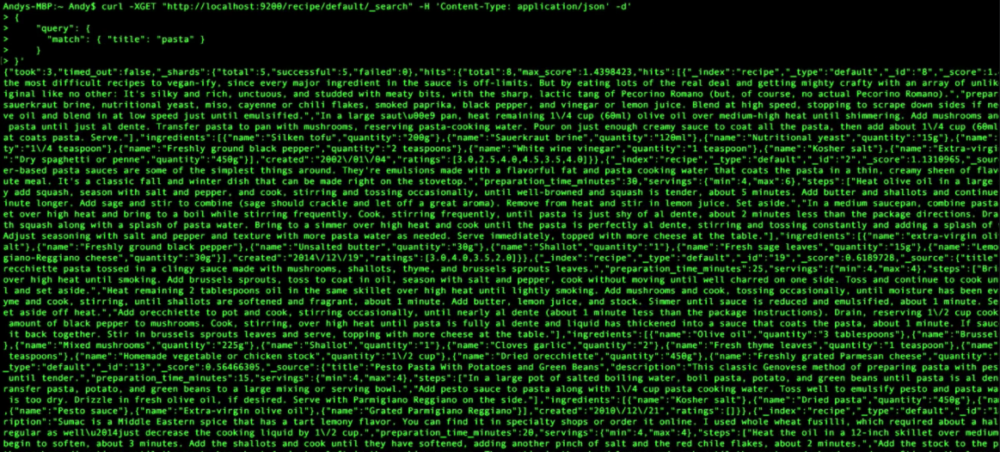
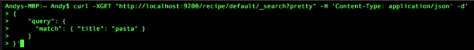
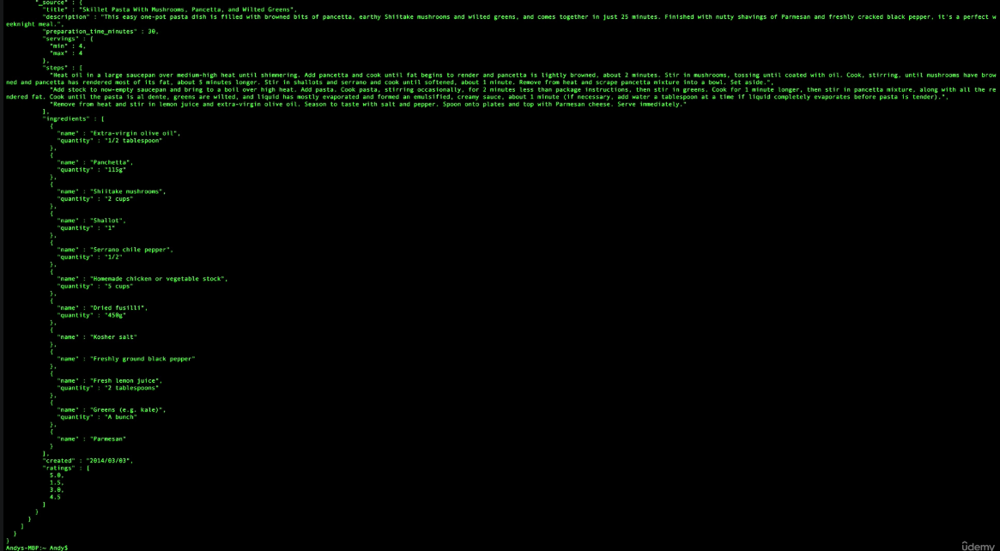
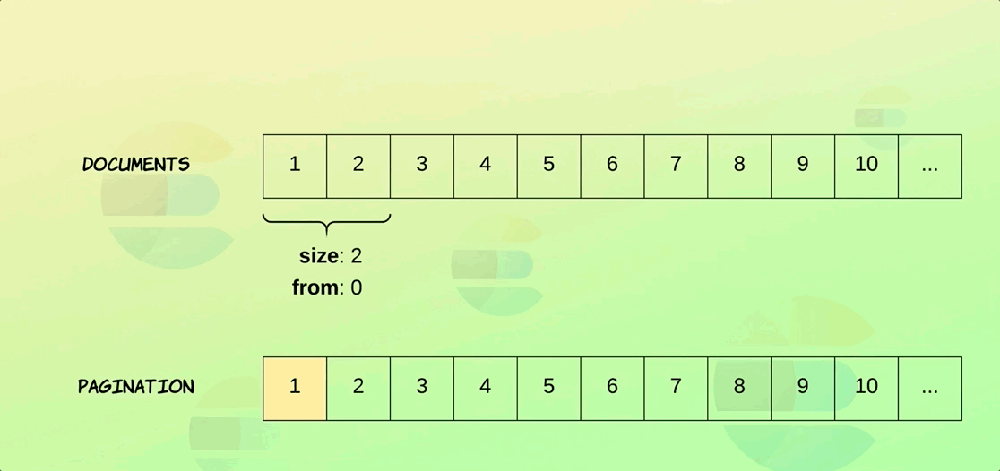

- [Specifying the result format](#specifying-the-result-format)
  - [yaml](#yaml)
  - [pretty](#pretty)
- [Source filtering](#source-filtering)
  - [_source](#_source)
- [Specifying the result(_source) size](#specifying-the-result_source-size)
- [Specifying an offset](#specifying-an-offset)
- [Pagination](#pagination)
  - [Limited to 10,000 results](#limited-to-10000-results)

# Specifying the result format

## yaml

```JSON
# get yaml instead of json
GET recipe/_search?format=yaml
{
  "query": {
    "match": {
      "title": "pasta"
    }
  }
}
```

## pretty

`<index>/_search?pretty`

Useful in terminal. Get your response formatted.






# Source filtering

Expecify the fields to be selected

## _source

- `_source: false` You can desable the source field.
  - Then it will only return the _id, and you can look up the id in another db
  - Increases throughput
- `_source: [<name of field>]`
  - Only return the listed field name
- `_source: { include: [], excludes: []}`

```JSON
# source filtering #
# exclude and include
GET recipe/_search
{
  "_source": {
    "includes": "ingredients.*",
    "excludes": "ingredients.name"
  }, 
  "query": {
    "match": {
      "title": "pasta"
    }
  }
}
# wildcards
# only have selected field
GET recipe/_search
{
  "_source": ["ingredients.*"],
  "query": {
    "match": {
      "title": "pasta"
    }
  }
}
# only have selected field
GET recipe/_search
{
  "_source": ["created"],
  "query": {
    "match": {
      "title": "pasta"
    }
  }
}

# disable _source
GET recipe/_search
{
  "_source": false,
  "query": {
    "match": {
      "title": "pasta"
    }
  }
}

# get yaml instead of json
GET recipe/_search?format=yaml
{
  "query": {
    "match": {
      "title": "pasta"
    }
  }
}
```

# Specifying the result(_source) size

Like a sql limit

```JSON
# default is 10
GET recipe/_search?size=2
{
  "_source": false,
  "query": {
    "match": {
      "title": "pasta"
    }
  }
}

GET recipe/_search
{
  "size": 2, 
  "_source": false,
  "query": {
    "match": {
      "title": "pasta"
    }
  }
}
```

# Specifying an offset

From the total list start from the doc index number.

- Defaults 0
- Count start from 0

```JSON
# defaults 0
# count start from 0
# A pagination component keep track of the from and sets the size
GET recipe/_search
{
  "_source": false,
  "size": 2,
  "from": 0, 
  "query": {
    "match": {
      "title": "pasta"
    }
  }
}
```

# Pagination



- Frontend component: keeps track of the offset number, and sets the size number.
- Backend: uses offset, and size to simulate traversal of hits.
- total_pages = ceil(total_hits / page_size)
- from = ( page_size * ( page_number -1 )

## Limited to 10,000 results

- due to heap memory limitation
- this limit is a safe guard.
- If you need more, [search after](https://www.elastic.co/guide/en/elasticsearch/reference/current/paginate-search-results.html#search-after) can work
