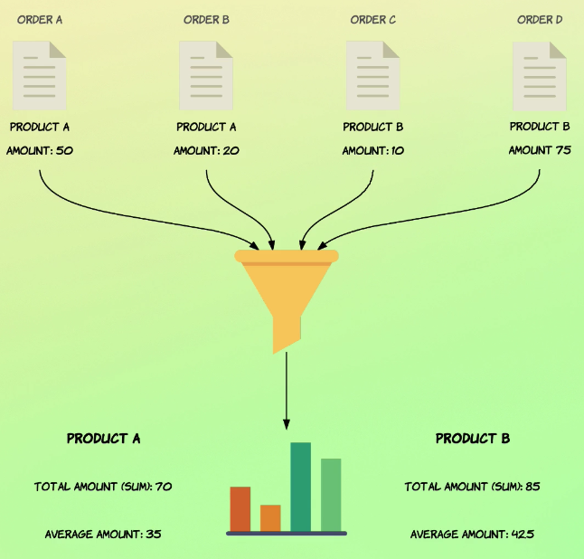

# Introduction to aggregations

So aggregations are way of grouping and extracting statistics and summaries from your data and aggregation works on a set of documents which is defined by the execution context.

## Import aggregation data

`curl -k -H "Content-Type: application/x-ndjson" -XPOST https://localhost:9200/recipe/_bulk --data-binary "@mapping-and-analysis.json" -u id:password`

**Not yet imported**

# Metric aggregations

# Introduction to bucket aggregations

# Documents counts are approximate

# Nested aggregations
