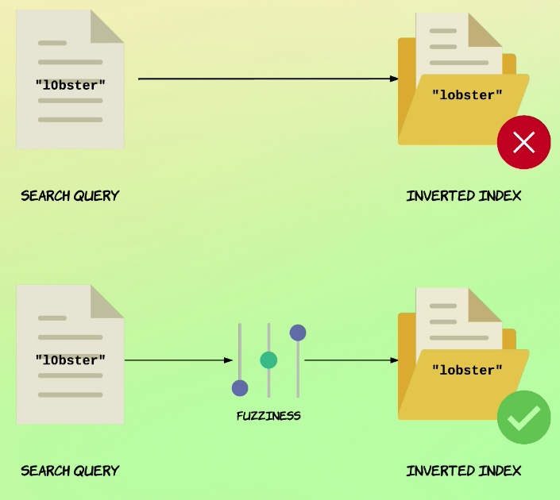
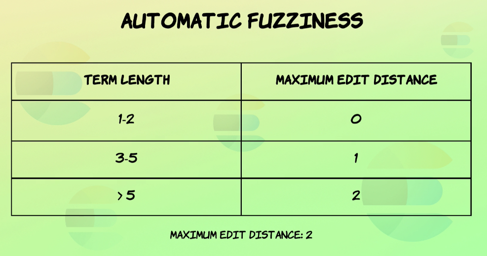
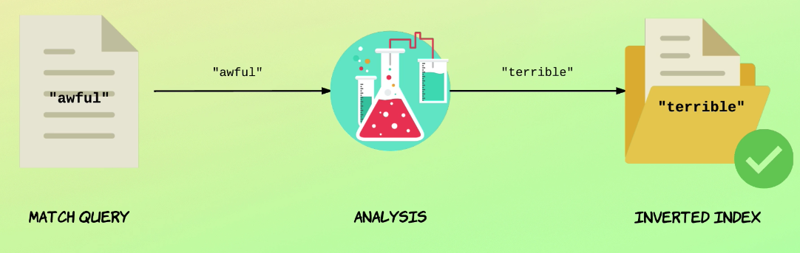
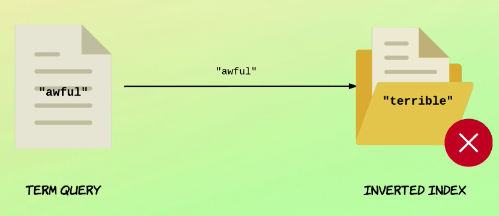
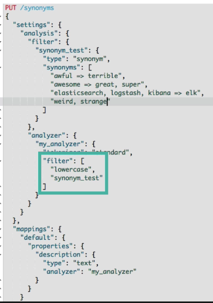
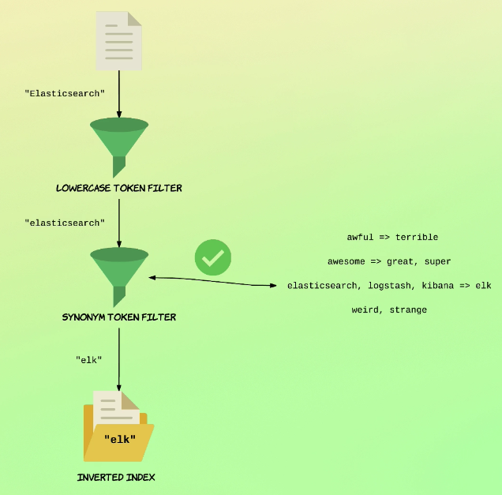

- [Introduction to this section](#introduction-to-this-section)
- [Creating proximity index](#creating-proximity-index)
- [Proximity searches `slop`](#proximity-searches-slop)
  - [So how do you know which value to specify for the slope parameter?](#so-how-do-you-know-which-value-to-specify-for-the-slope-parameter)
- [Affecting relevance scoring with proximity](#affecting-relevance-scoring-with-proximity)
- [Fuzzy match query (handling typos)](#fuzzy-match-query-handling-typos)
  - [Why 2 max fuzziness?](#why-2-max-fuzziness)
- [Fuzzy query](#fuzzy-query)
  - [Transpositions](#transpositions)
- [Fuzzy query](#fuzzy-query-1)
- [Adding synonyms](#adding-synonyms)
  - [Keep in mind when you are adding the synonym token filter](#keep-in-mind-when-you-are-adding-the-synonym-token-filter)
- [Adding synonyms from file](#adding-synonyms-from-file)
- [Highlighting matches in fields](#highlighting-matches-in-fields)
- [Stemming](#stemming)

# Introduction to this section

- A couple of examples is to:
  - handle typos,
  - using synonyms and
  - Stayman highlighting matching parts of documents and
  - more.

# Creating proximity index

```JSON
# creating new index with 5 docs
PUT proximity/_doc/1
{
  "title": "Spicy Sauce"
}

PUT proximity/_doc/2
{
  "title": "Spicy Tomato Sauce"
}

PUT proximity/_doc/3
{
  "title": "Spicy Tomato and Garlic Sauce"
}

PUT proximity/_doc/4
{
  "title": "Tomato Sauce (spicy)"
}

PUT proximity/_doc/5
{
  "title": "Spicy and very delicious Tomato Sauce"
}

GET proximity/_search
{
  "query": {
    "match_all": {}
  }
}
```

# Proximity searches `slop`

[resource](https://www.elastic.co/guide/en/elasticsearch/reference/current/query-dsl-query-string-query.html#_proximity_searches)

A proximity search is a phrase search with a slop value.

- different from match
  - With the match  query, the slop value is about changing individual characters within the terms.
- Makes search into proximity searches

These were the basics of adding flexibility to the match phrase query, if you want to relax the requirementthat all terms must appear in a sequence and in a particular order, then you can do so with this parameter.


The point is the terms may be moved around a number of times to match the document as long as the edit distance does not exceed what we have specified for the slope parameter.

```JSON
# A proximity search is a phrase search with a slop value.
GET proximity/_search
{
  "query": {
    "match_phrase": {
      "title": {
        "query": "spicy sauce",
        "slop": 1
      }
    }
  }
}

# The point is the terms may be moved around a number of times to match the document as long as the edit distance does not exceed what we have specified for the slope parameter.
GET proximity/_search
{
  "query": {
    "match_phrase": {
      "title": {
        "query": "spicy sauce",
        "slop": 2
      }
    }
  }
}
```

## So how do you know which value to specify for the slope parameter?

Well, there is of course no definitive answer to that question because it really depends. That's something you will tweak over time, either by trial and error or by testing it out on some datasets.

You should know that things were a bit simple in our examples because of race query only consisted of two terms in the real world, this won't always be the case. So the value that you specified by this law parameter is the maximum distance for all of the terms, not just between any two terms. So the more terms you have, the higher you should probably set the slope. The value really depends on the data and what kind of matching you're going for.

A decent idea would be to set the slope a bit higher than you otherwise would because the proximity affects relevant scores. If including less relevant documents within the resource is acceptable to you, then this might be a way to go.

# Affecting relevance scoring with proximity

How to get

- the benefit of match queries
  - The most the keywords appear the better
- Proximity search
  - how close each words are to each other

```JSON
GET proximity/_search
{
  "query": {
    "bool": {
      "must": [
        {
          "match": {
            "title": {
              "query": "spicy sauce"
            }
          }
        }
      ],
      "should": [
        {
          "match_phrase": {
            "title": {
              "query": "spicy sauce",
              "slop": 5
            }
          }
        }
      ]
    }
  }
}
```

# Fuzzy match query (handling typos)



```JSON

```



## Why 2 max fuzziness?

1. First of all, studies have shown that 80 percent of human misspellings can be corrected with an edit distance of just one. So a value of one or two will catch almost all mistakes.

2. Secondly, being able to specify a higher fussiness value would quickly reduce performance.
3. Also, a higher fustiness value would mean that you would begin to see strange and unpredictable results.

# Fuzzy query


`fuzziness: auto`

- "auto" is ideal
- If you have control over the query, then you can indeed specify the value yourself.
  - But situations where that makes sense are pretty rare.

```JSON
GET products/_search
{
  "query": {
    "match": {
      "name": {
        "query": "lobster"
      }
    }
  }
}

GET products/_search
{
  "query": {
    "match": {
      "name": {
        "query": "l0bster",
        "fuzziness": "auto"
      }  
    }
  }
}

# fuzziness 1 changes 1 char per term
GET products/_search

```

## Transpositions

`AB => BA`
`LVIE => LIVE`

Counted has a single edit.

- Enable by default
  - `fuzzy_transpositions: false`
- Part of fuzzy match

-

```JSON
# you get a match with trasnpositions on
GET products/_search
{
  "query": {
    "match": {
      "name": {
        "query": "lvie",
        "fuzziness": 1
      }
    }
  }
}

# you don't get a match with transposition false
# need more than 1 edit
GET products/_search
{
  "query": {
    "match": {
      "name": {
        "query": "lvie",
        "fuzziness": 1,
        "fuzzy_transpositions": "false"
      }
    }
  }
}
```

# Fuzzy query

- term level query.
- match with fuzzy is prefer due to the input being analyze

```JSON
GET products/_search
{
  "query": {
    "fuzzy": {
      "name": {
        "value": "LOBSTER",
        "fuzziness": "auto"
      }
    }
  }
}

GET products/_search
{
  "query": {
    "fuzzy": {
      "name": {
        "value": "lobster",
        "fuzziness": "auto"
      }
    }
  }
}
```

# Adding synonyms

terms to be replace with other terms at the reverse index level.

`<input words> => <replacement words for reverse index>`

- eather side can have a list of words separate by `,` commads
- only having the input words will group them together in the reverse index





```JSON

```

## Keep in mind when you are adding the synonym token filter

For example if you added later than the lowercase token filter, higher case inputs will not work





# Adding synonyms from file

# Highlighting matches in fields

# Stemming
