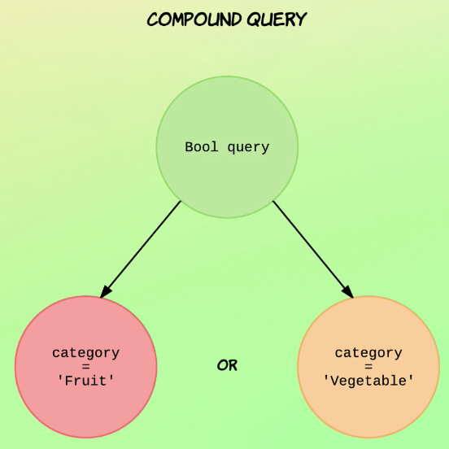
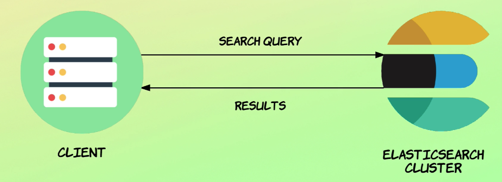
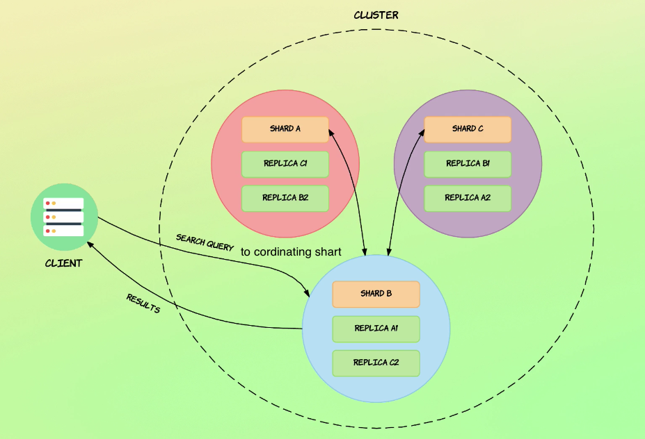
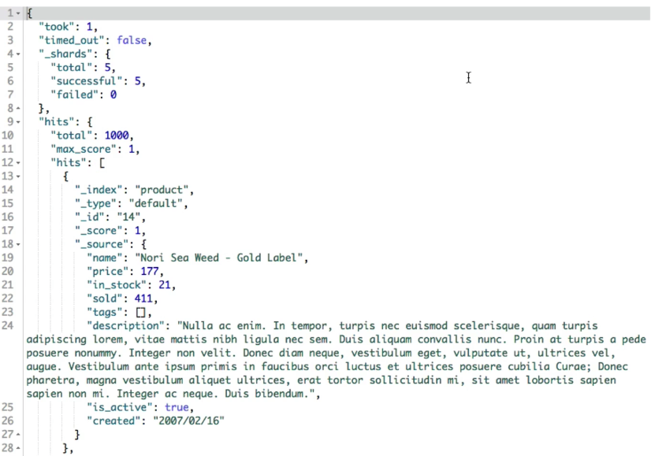
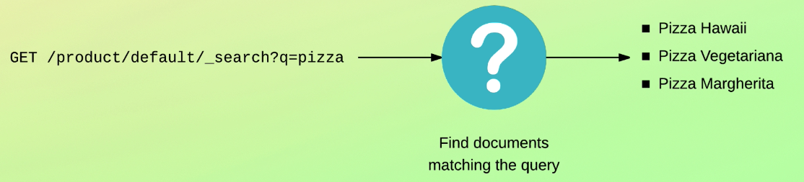
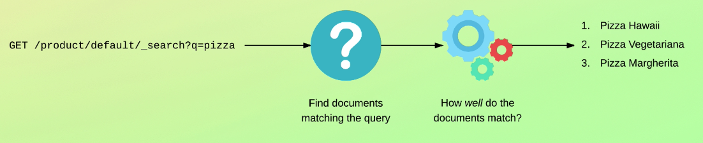
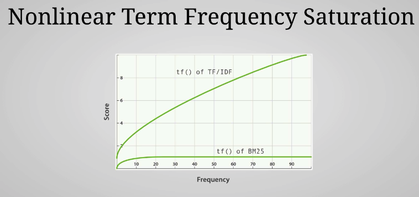

- [Search methods](#search-methods)

# Search methods

## DSL queries

### Long

```JSON
GET product/_search
{
  "query": {
    "match": {
      "description": {
        "value": "red wine"
      }
    }
  }
}
```

### Short version (because we don't configure the query)

```JSON
GET product/_search
{
  "query": {
    "match": {
      "description": "red wine"
    }
  }
}
```

### supports cruise string queries

```JSON
GET product/_search
{
  "query": {
    "query_string": {
      "query": "name:pasta"
    }
  }
}
```

## Request URI (Cruise string queries)

`GET product/_search?q=name:pasta`

Has limitations.
Great for terminals.

# Searching with the request URI

```JSON
#returning everything
GET products/_search?q=*

# search by field
# <field name>:<value>
GET products/_search?q=name:lobster

# array of field
GET products/_search?q=tags:Meat 

# Multiple fields
# in terminal you need to do %20 instead of white space
GET products/_search?q=tags:Meat and name:tuna
```

# Introducing the query DSL

## Leaf query

`category = "fruit"`

## Compound query



## Find all

```JSON
GET products/_search
{
  "query": {
    "match_all": {}
  }
}
```

# Searching for data




# Understanding query results



- took: miliseconds the query took
- time_out: boolean flag seeing if the search query has time out
- _shards
  - total: total number of shard that where search
  - successful: total successful shard search
  - failed: total failed shard search
- hits: contains the search results
  - total: number of documents that match the query
  - max_score: the highest score match of all docs
  - hits: All docs info
    - score: how well the document match the query

    -

# Understanding relevance scores



## Term Frequency / Inverse Document Frequency (TF/IDF)

### Factors

- Calculated at index time.
- **are on a per share basis**.

#### Term Frequency (TF)

How many times does the term appear in the field for a given document?

The more it appear in the doc the more important it is

#### Inverse Document Frequency (IDF)

How often does the term appear within the index (i.e. across all documents)?

The more it appear in the index the less important it is.

#### Field-length norm

How long is the field?

Term appearing in short text is more important than text appearing in long text.

## Okapi BM25

The relevance scoring algorithm currently used by Elasticsearch.
Better at handling stop words
**Although the value of the stop words are limited, they do have some value.**

A document containing the text of a book will have lots of words for Fields because the content will be large with the TF IDF algorithm. This would often lead to the suburbs being boosted more than they should because they occur so many times. PM 25 solves this problem by using something super fancy called nonlinear term frequency saturation.

### Nonlinear term requency saturation



The idea is that PM 25 has an upper limit for how much a term can be boosted based on how many times it occurs. If a term appears five to 10 times, it has a significantly larger impact on the relevance than if it just occurred once or twice.

But as the number of occurrences increase, the relevance boost quickly becomes less significant, meaning that the boost short term that appears 1000 times will almost be the same as if it occurred 30 times.

### Better at handling stop words 

### Improes the field-length norm factor

### Can be configured with parameters

## There are ways in which you can change the relevance by affecting the scoring with queries. 

But it is also possible to change how ElasticSearch calculates the scores. That being said, that gets very advanced and it's rare that you would need to do so. I won't get into that because I strongly discouraged that you get into that unless you really know what you're doing. do a chore

The reason is that it's advanced, but also that you will often find yourself constantly tweaking the relevance, oftentimes without actually getting anywhere before telling you.

# Debugging unexpected search results

```JSON
GET products/_explain/1
{
  "query": {
    "term": {
      "name": "lobster"
    }
  }
}
```

```JSON
{
  "_index" : "products",
  "_id" : "1",
  "matched" : false,
  "explanation" : {
    "value" : 0.0,
    "description" : "no matching term",
    "details" : [ ]
  }
}

```

# Query contexts

## Query context vs filter context

**If a query clause should affect relevance, then added to the query context otherwise used to filter context.**

How well do documents match?
Do documents match?
No relevance scores are calculated
Filtering on dates, status, ranges, etc
Query context affects relevance; filter context doesn't


