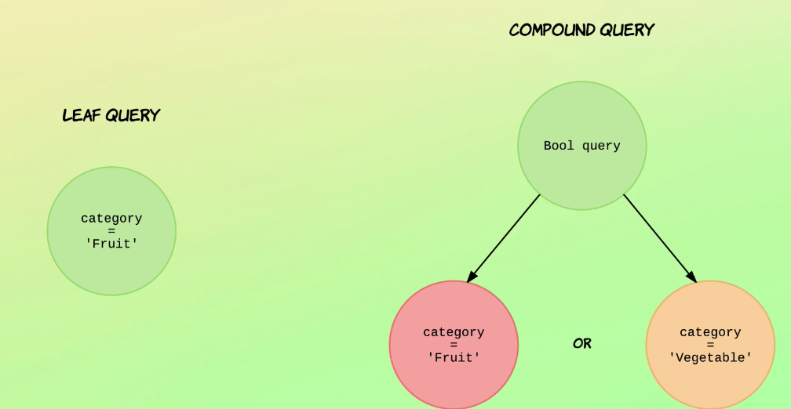

- [Introudction to compound queries](#introudction-to-compound-queries)
- [Querying with boolean logic](#querying-with-boolean-logic)
- [Debugging bool queries with named queries](#debugging-bool-queries-with-named-queries)
  - [Matched_queries will have all the queries that it matches](#matched_queries-will-have-all-the-queries-that-it-matches)
- [How the "match" query works](#how-the-match-query-works)

# Introudction to compound queries



Compound queries wraps leaf queries or more compound queries into a single operation.

# Querying with boolean logic

- Like the where clause in sql + deals with _score and score boosting. boost their brain development
- Can be use with the query or filter context
- Array is not needed if you only have 1 input
- The score from each matching must or should clause will be**added together to provide the final _score**for each document.

- Fields
  - must:
    - require to match all fields given, and rank by how well it matches.
    - Give range query a score of 1 by default
  - filter:
    - For the fields match or not
    - Can be catch
  - should:
    - boost score if they match but not require.
    - Great field to define preferences.
    - If there is no must or filter, at least 1 is require
  - must_not:
    - executed in the filter context
    - scoring is ignore and score of 0 is return for all matching docs
    - Queries are consider for catching

    -

[Boolean query](https://www.elastic.co/guide/en/elasticsearch/reference/current/query-dsl-bool-query.html)

```JSON
GET recipe/_search
{
  "query": {
    "bool": {
      "must": [
        {
          "match": {
            "ingredients.name": "parmesan"
          }
        }
      ],
      "must_not": [
        {
          "match": {
            "ingredients.name": "tuna"
          }
        }
      ],
      "should": [
        {
          "match": {
            "ingredients.name": "parsley"
          }
        }
      ], 
      "filter": [
        {
          "range": {
            "preparation_time_minutes": {
              "lte": 15
            }
          }
        }
      ]
    }
  }
}

GET recipe/_search
{
  "query": {
    "bool": {
      "should": [
        {
          "match": {
            "ingredients.name": "parmesan"
          }
        }
      ]
    }
  }
}
```

# Debugging bool queries with named queries

Only needed for the should query.

```JSON
# no names
GET recipe/_search
{
  "query": {
    "bool": {
      "must": [
        {
          "match": {
            "ingredients.name": "parmesan"
          }
        }
      ],
      "must_not": [
        {
          "match": {
            "ingredients.name": "tuna"
          }
        }
      ],
      "should": [
        {
          "match": {
            "ingredients.name": "parsley"
          }
        }
      ],
      "filter": [
        {
          "range": {
            "preparation_time_minutes": {
              "lte": 15
            }
          }
        }
      ]
    }
  }
}

# with names
# expect matched_queries field
GET recipe/_search
{
  "query": {
    "bool": {
      "must": [
        {
          "match": {
            "ingredients.name": {
              "query": "parmesan",
              "_name": "parmesan_must"
            }
          }
        }
      ],
      "must_not": [
        {
          "match": {
            "ingredients.name": {
              "query": "tuna",
              "_name": "tuna_must_not"
            }
          }
        }
      ],
      "should": [
        {
          "match": {
            "ingredients.name": {
              "query": "parsley",
              "_name": "parsley_should"
            }
          }
        }
      ],
      "filter": [
        {
          "range": {
            "preparation_time_minutes": {
              "lte": 15,
              "_name": "preparation_time_minutes_filter"
            }
          }
        }
      ]
    }
  }
}
```

## Matched_queries will have all the queries that it matches

Making it easier to see why it score so high.

Higher score will have most names

```JSON
"matched_queries" : [
  "parmesan_must",
  "preparation_time_minutes_filter",
  "parsley_should"
]
```

Lower score will have less.

```JSON
"matched_queries" : [
  "parmesan_must",
  "preparation_time_minutes_filter"
]
```

# How the "match" query works
