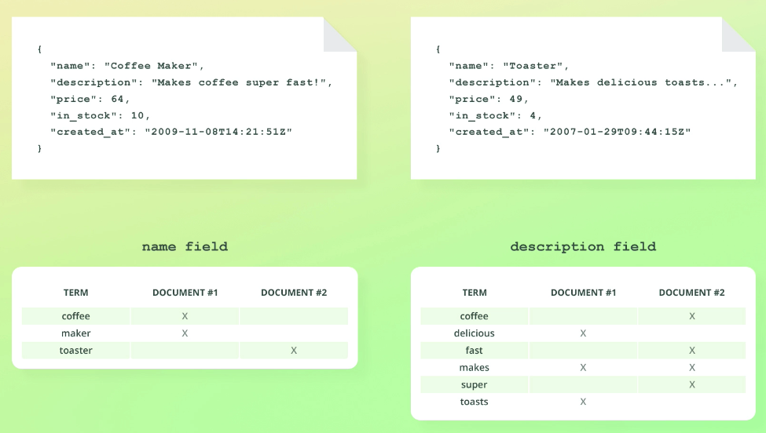

- [Introduction to analysis](#introduction-to-analysis)
  - [analysis (text analysis)](#analysis-text-analysis)
  - [Character filters](#character-filters)
  - [Tokenizers](#tokenizers)
  - [Token Filters](#token-filters)
  - [Built-in and custom components](#built-in-and-custom-components)
  - [Standard analyzer](#standard-analyzer)
- [Using the Analyze API](#using-the-analyze-api)
  - [Instead of specifying an analyzer, we can also specify the parts making up an analyzer](#instead-of-specifying-an-analyzer-we-can-also-specify-the-parts-making-up-an-analyzer)
- [Undestanding inverted indices](#undestanding-inverted-indices)
  - [Inverted indices: words => docs](#inverted-indices-words--docs)
  - [What happens if we index documents containing a number of different fields?](#what-happens-if-we-index-documents-containing-a-number-of-different-fields)
  - [Summary](#summary)
- [Introduction to mapping](#introduction-to-mapping)
  - [What is mapping?](#what-is-mapping)
- [Overview of data types](#overview-of-data-types)
  - [Object](#object)
    - [Flattened nested objects](#flattened-nested-objects)
    - [Flattened array of objects](#flattened-array-of-objects)
  - [nested data type](#nested-data-type)
  - [Keyword data type](#keyword-data-type)
  - [More types](#more-types)
  - [Specialize data types](#specialize-data-types)
- [How the keyword data type works](#how-the-keyword-data-type-works)
  - [How Keywords fields are analyzed](#how-keywords-fields-are-analyzed)
- [Understanding type coercion](#understanding-type-coercion)
  - [introduction to type coercion](#introduction-to-type-coercion)
  - [With coercion sometimes, providing the wrong data type is okay](#with-coercion-sometimes-providing-the-wrong-data-type-is-okay)
  - [Undestanding the _source object](#undestanding-the-_source-object)
  - [A few more things](#a-few-more-things)
- [Introduction to arrays](#introduction-to-arrays)
  - [Constraints](#constraints)
    - [Arrays values should be of the same data type (or coerce to be the same if able)](#arrays-values-should-be-of-the-same-data-type-or-coerce-to-be-the-same-if-able)
    - [Coercion only works for fields that are already mapped](#coercion-only-works-for-fields-that-are-already-mapped)
    - [I don't recommend using coercion (at least not on purpose)](#i-dont-recommend-using-coercion-at-least-not-on-purpose)
  - [Nested arrays](#nested-arrays)
  - [A small reminder](#a-small-reminder)
- [Adding explicit mapping](#adding-explicit-mapping)
  - [add new doc with fields that fail mapping](#add-new-doc-with-fields-that-fail-mapping)
  - [add new doc with valid fields](#add-new-doc-with-valid-fields)
- [Retrieving mappings](#retrieving-mappings)
  - [get the mapping of an index](#get-the-mapping-of-an-index)
  - [Get mapping of a field](#get-mapping-of-a-field)
  - [Get mapping of a nested object](#get-mapping-of-a-nested-object)
- [Using dot notation in field names](#using-dot-notation-in-field-names)
- [Adding mappings to existing indices](#adding-mappings-to-existing-indices)
- [How dates work in Elasticsearch](#how-dates-work-in-elasticsearch)
  - [Default behavior of date fields](#default-behavior-of-date-fields)
  - [How date fields are stored](#how-date-fields-are-stored)
  - [UNIX time and epoch time](#unix-time-and-epoch-time)
  - [Inserting dates](#inserting-dates)
    - [Response](#response)
  - [Summary](#summary-1)
- [How missing fields are handled](#how-missing-fields-are-handled)
- [Overview of mapping parameters](#overview-of-mapping-parameters)
  - [format parameter](#format-parameter)
  - [Properties parameter](#properties-parameter)
  - [coerce parameter](#coerce-parameter)
  - [Introduction to doc_values](#introduction-to-doc_values)
    - [Disabling odc_values](#disabling-odc_values)
  - [norms parameter](#norms-parameter)
    - [Example](#example)
  - [index parameter](#index-parameter)
    - [Example](#example-1)
  - [null_value parameter](#null_value-parameter)
  - [copy_to parameter](#copy_to-parameter)
    - [Example](#example-2)
- [Updating existing mappings](#updating-existing-mappings)
  - [Limitations for updating mappins](#limitations-for-updating-mappins)
- [Reindexing documents with the Reindex API](#reindexing-documents-with-the-reindex-api)
  - [Create new index base on the old index](#create-new-index-base-on-the-old-index)
    - [Get the old index](#get-the-old-index)
    - [Copy pase the structure to the new index and update any desire fields](#copy-pase-the-structure-to-the-new-index-and-update-any-desire-fields)
    - [Reindexing](#reindexing)
  - [_source data types](#_source-data-types)
    - [Create new index with update field type and _source data](#create-new-index-with-update-field-type-and-_source-data)
    - [See index changes](#see-index-changes)
  - [Reindex documents matching a query](#reindex-documents-matching-a-query)
    - [For whole index](#for-whole-index)
    - [Partial Index](#partial-index)
  - [Removing fields](#removing-fields)
    - [Source filtering](#source-filtering)
  - [Changing a field's name](#changing-a-fields-name)
  - [Ignore reviews with ratings below 4.0 (specify the operation for the document within the script)](#ignore-reviews-with-ratings-below-40-specify-the-operation-for-the-document-within-the-script)
    - [Using ctx.op within scripts](#using-ctxop-within-scripts)
  - [Parameters for the Reindex API](#parameters-for-the-reindex-api)
  - [Batching and throttling](#batching-and-throttling)
- [Defining field aliases](#defining-field-aliases)
  - [Adding alias](#adding-alias)
    - [Same results for both queries](#same-results-for-both-queries)
  - [Updating field aliases](#updating-field-aliases)
  - [Index aliases](#index-aliases)
- [Multi-field mappings](#multi-field-mappings)
  - [Create multi fields](#create-multi-fields)
  - [What happens in the background](#what-happens-in-the-background)
  - [searching multi fields](#searching-multi-fields)

# Introduction to analysis

## analysis (text analysis)

Text fields/values are analyzed when indexing documents.

The result is stored in data structures tha are efficient for searching etc.

- The _source object is not used when searching for documents
  - It contains the exact values specified when indexing a document


## Character filters

- Adds, removes  or changes characters
- Analyzers contain zero or more character filters
- Character filters are applied in the order in which they are specified
- Example (html_strip filter)
  - Input: `"I&apos;m in a <em>good</em> mood&nbsp;-&nbsp;and <strong>love</strong> acai!"`
  - Output: "I'm in a good mood - and love acai!"

## Tokenizers

- An analyzer contains **one** tokenizer
- Tokenizes a string, i.e. splits it into tokens
- Characters may be stripped as part of the tokenization
- Example
  - Input: "I REALLY like beer!"
  - Output: ["I", "REALLY", "like", "beer"]

## Token Filters

- Receive the output of the tokenizer as input (i.e. the tokens)
- A token filter can add, remove, or modify tokens
- Ana analyzer conains zero or more token filters
- Token filters are applied in the order in which they are specified
- Example (lowercase filter)
  - Input: ["I", "REALLY", "like", "beer"]
  - Output: ["i", "really", "like", "beer"]

## Built-in and custom components

- Built-in analyzers, character filters, tokenizers, and token filters are available
- We can also build custom ones

## Standard analyzer


# Using the Analyze API

Useful for testing out the analyzer before applying them to documents.

```JSON
# using the starndard analyzer
POST /_analyze
{
  "text": "2 guys walk into    a bar, but the third... DUCKS! :-)",
  "analyzer": "standard"
}
```

```JSON
{
  "tokens" : [
    {
      "token" : "2",
      "start_offset" : 0,
      "end_offset" : 1,
      "type" : "<NUM>",
      "position" : 0
    },
    {
      "token" : "guys",
      "start_offset" : 2,
      "end_offset" : 6,
      "type" : "<ALPHANUM>",
      "position" : 1
    },
    {
      "token" : "walk",
      "start_offset" : 7,
      "end_offset" : 11,
      "type" : "<ALPHANUM>",
      "position" : 2
    },
    {
      "token" : "into",
      "start_offset" : 12,
      "end_offset" : 16,
      "type" : "<ALPHANUM>",
      "position" : 3
    },
    {
      "token" : "a",
      "start_offset" : 20,
      "end_offset" : 21,
      "type" : "<ALPHANUM>",
      "position" : 4
    },
    {
      "token" : "bar",
      "start_offset" : 22,
      "end_offset" : 25,
      "type" : "<ALPHANUM>",
      "position" : 5
    },
    {
      "token" : "but",
      "start_offset" : 27,
      "end_offset" : 30,
      "type" : "<ALPHANUM>",
      "position" : 6
    },
    {
      "token" : "the",
      "start_offset" : 31,
      "end_offset" : 34,
      "type" : "<ALPHANUM>",
      "position" : 7
    },
    {
      "token" : "third",
      "start_offset" : 35,
      "end_offset" : 40,
      "type" : "<ALPHANUM>",
      "position" : 8
    },
    {
      "token" : "ducks",
      "start_offset" : 44,
      "end_offset" : 49,
      "type" : "<ALPHANUM>",
      "position" : 9
    }
  ]
}
```

## Instead of specifying an analyzer, we can also specify the parts making up an analyzer

**char_filter**: being where we define any character filters.

- Since the “standard” analyzer doesn’t make use of any character filters, I will
- could have left out the parameter entirely as the behavior would be the same

**Tokenizer**

**Filters**

This is what the standard analyzer does.

```JSON
# expliciting writting the standard anaylyzer
# same results has the standard analyzer
POST _analyze
{
  "text": "2 guys walk into    a bar, but the third... DUCKS! :-)",
  "char_filter": [],
  "tokenizer": "standard",
  "filter": ["lowercase"]
}
```

# Undestanding inverted indices

- A field's values are stored in one of several data structures
  - The data structure depends on the field's data type
- Ensures efficient data access - i.e. searches
- Handle by Apache Lucene, not Elasticsearch

## Inverted indices: words => docs


Note:

- Inverted indices contain more than just terms and document IDs
  - E.g. information for relevance scoring
  - Provides fast look ups
- Normal indices
  - docs => words
  - Doesn't provide fast look ups

Other things to keep in mind

- Mapping between terms and which documents contain them
- Outside the context of analyzers, we use the terminology "terms"
- One inverted index per text field
- Other data types use BKD trees, for instance

## What happens if we index documents containing a number of different fields?

An inverted index is actually created for each text field. **Inverted indices are scope by the field.**



## Summary

- Vaues for a text field are analyzed and the results are stored within an inverted index
- Each field has a dedicated inverted index
- An inverted index is a mapping between terms and which documents contain them
- Terms are sorted alphabetically for performance reasons
Created and maintained by Apache Lucene, not Elasticsearch
- Inverted indices enable **fast** searches
- Inverted indices contain other data as well
  - E.g. things used for relevance scoring
- Elasticsearch (technically, Apache Lucene) uses other data structures as well
  - E.g. BKD trees for numeric values, dates, and geospatial data

# Introduction to mapping

## What is mapping?

Explicit mapping example


- Defines the structure of documents (e.g. fields and their data types)
  - Also used to configure how values are indexed
- Similar to a table's schema in a relational database
- Explicit mapping
  - We define field mappings ourselves
- Dynamic mapping
  - We define field mappings using the mapping API

# Overview of data types

[Extensive list of data types.](https://www.elastic.co/guide/en/elasticsearch/reference/current/mapping-types.html)

## Object


The way this is mapped, is that a **“properties” key is added for objects instead of specifying the “type”** key as with other data types. The type is therefore not just set to “object” as you might have expected. “properties” is actually a mapping parameter

- Used for any JSON object
- Objects may be nested
  - 
  - Nested object continues to use "properties"
- Objects are **not** stored as objects in Apache Lucene
  - Objects are transformed to ensure that we can index any valid JSON
  - In particular, **objects are flattened**

### Flattened nested objects


The hierarchy is keep by using dot notation in the naming convention.

### Flattened array of objects

Would the result be duplicated field names? Yes.

Group by field name and index like an array


Note: Query is a mock query

This will cause the and to act like an or in the query

Solution is nested data type

## nested data type


- Similar to the object data type, but maintains object relationships
  - Useful when indexing arrays of objects
- Enables us to query objects independently
  - Must use the nested query
- nested objects are stored as hidden documents
  - Will not show up in query results until search by directly
  - one-doc-per-nested-object plus one for the product = 11 total docs
  - 

## Keyword data type

- used **for exact matching** of values
- Typically used for **filtering, aggregations, and sorting**
- E.g. searching for articles with a status of PUBLISHED
- For full-text searches, use the text data type instead
  - E.g. searching the body text of an article

## More types

- integer
- long
- boolean
- text
- double
- short
- data
- float

## Specialize data types

- IP (address)
- ETC

# How the keyword data type works

- Keyword fields are analyzed with the keyword analyzer
- The keyword analyzer is a no-op alayzer
  - It outputs the unmodified string as a single token
  - This token is then placed into the inverted index
- keyword fields are used for exact matching, aggregations, and sorting

## How Keywords fields are analyzed

- keywords fields are analyzed with the keyword analyzer
- The keyword analyzer is a no-op analyzer
  - It outputs the unmodified string as a single token

```JSON
# keywords analyzer
POST _analyze
{
  "text": "2 guys walk into    a bar, but the third... DUCKS! :-)",
  "analyzer": "keyword"
}
```

```JSON
{
  "tokens" : [
    {
      "token" : "2 guys walk into    a bar, but the third... DUCKS! :-)",
      "start_offset" : 0,
      "end_offset" : 54,
      "type" : "word",
      "position" : 0
    }
  ]
}
```


Note: you can use the lowercase filter to lowercase all email because case doesn't matter.

# Understanding type coercion

like javascript "==" operator

## introduction to type coercion


- Data types are inspected when indexing documents
  - They are validated, and some invalid values are rejected
  - E.g. trying to index an object for a text field

## With coercion sometimes, providing the wrong data type is okay

```JSON
# understanding type coercion
PUT coercion_test/_doc/1
{
  "price": 7.4
}

PUT coercion_test/_doc/2
{
  "price": "7.4"
}
```

Creates two documents.

```JSON
PUT coercion_test/_doc/3
{
  "price": "7.4m"
}
```

Fails due to string no being a string number

```JSON
{
  "error" : {
    "root_cause" : [
      {
        "type" : "mapper_parsing_exception",
        "reason" : "failed to parse field [price] of type [float] in document with id '3'. Preview of field's value: '7.4m'"
      }
    ],
    "type" : "mapper_parsing_exception",
    "reason" : "failed to parse field [price] of type [float] in document with id '3'. Preview of field's value: '7.4m'",
    "caused_by" : {
      "type" : "number_format_exception",
      "reason" : "For input string: \"7.4m\""
    }
  },
  "status" : 400
}
```

## Undestanding the _source object

```JSON
GET coercion_test/_doc/2
```

```JSON
{
  "_index" : "coercion_test",
  "_id" : "2",
  "_version" : 1,
  "_seq_no" : 1,
  "_primary_term" : 1,
  "found" : true,
  "_source" : {
    "price" : "7.4"
  }
}
```

- contains the values that were supplied at index time("7.4")
  - Not the values that are indexed (7.4)
- Search queries use indexed values, not _source
  - BKD trees, inverted indices, etc.
- _source does not reflect how values are indexed
  - Keep coercion in mind if you use values from _source
  - In this example, it might be either a string or floating point

## A few more things

- supplying a floating point for an integer field will truncate it to an integer
- Coercion is not used for dynamic mapping
  - Supplying "7.4" for a new field will create a text mapping
- Always try to use the correct data type
  - Especially the first time you index a field
- **Disabling coercion** is a matter of preference
  - It is **enabled by default**

```JSON
# clean up
DELETE coercion_test
```

# Introduction to arrays


- There is no such thing as an array data type
- Any field may contain zero or more values
  - No configuration or mapping needed
  - Simply supply an array when indexing a document
- We did this for the *tags* field for the products index

```JSON
POST _analyze
{
  "text": ["Strings are simply", "merged together."],
  "analyzer": "standard"
}
```

```JSON
{
  "tokens" : [
    {
      "token" : "strings",
      "start_offset" : 0,
      "end_offset" : 7,
      "type" : "<ALPHANUM>",
      "position" : 0
    },
    {
      "token" : "are",
      "start_offset" : 8,
      "end_offset" : 11,
      "type" : "<ALPHANUM>",
      "position" : 1
    },
    {
      "token" : "simply",
      "start_offset" : 12,
      "end_offset" : 18,
      "type" : "<ALPHANUM>",
      "position" : 2
    },
    {
      "token" : "merged",
      "start_offset" : 19,
      "end_offset" : 25,
      "type" : "<ALPHANUM>",
      "position" : 3
    },
    {
      "token" : "together",
      "start_offset" : 26,
      "end_offset" : 34,
      "type" : "<ALPHANUM>",
      "position" : 4
    }
  ]
}
```

## Constraints

### Arrays values should be of the same data type (or coerce to be the same if able)


### Coercion only works for fields that are already mapped

If creating a field mapping with dynamic mapping, an array **must** contain the same data type

### I don't recommend using coercion (at least not on purpose)

## Nested arrays

- Arrays may contain nested arrays
- Arrays are flattened during indexing
- [ 1, [ 2, 3 ], [ 4, 5 ] ] becomes [ 1, 2, 3, 4, 5 ]

## A small reminder

Remember to use the **nested data type for arrays of objects** if you need **to query the objects independently**.

# Adding explicit mapping

```JSON
# Adding explicit mapping
PUT reviews
{
  "mappings": {
    "properties": {
      "rating": { "type": "float"},
      "content": { "type": "text"},
      "product_id": { "type": "integer"},
      "author": { 
        "properties": {
          "first_name": { "type": "text" },
          "last_name": { "type": "text"},
          "email": { "type": "keyword"}
        }
      }
    }
  }
}
```

```JSON
{
  "acknowledged" : true,
  "shards_acknowledged" : true,
  "index" : "reviews"
}
```

## add new doc with fields that fail mapping

email shouldn't be an object

```JSON
PUT reviews/_doc/1
{
  "rating": 5.0,
  "content": "Outstanding course! Bo really taught me a lot about Elasticsearch!",
  "product_id": 123,
  "author": {
    "first_name": "John",
    "last_name": "Doe",
    "email": {}
  }
}
```

```JSON
{
  "error" : {
    "root_cause" : [
      {
        "type" : "mapper_parsing_exception",
        "reason" : "failed to parse field [author.email] of type [keyword] in document with id '1'. Preview of field's value: '{}'"
      }
    ],
    "type" : "mapper_parsing_exception",
    "reason" : "failed to parse field [author.email] of type [keyword] in document with id '1'. Preview of field's value: '{}'",
    "caused_by" : {
      "type" : "illegal_state_exception",
      "reason" : "Can't get text on a START_OBJECT at 8:14"
    }
  },
  "status" : 400
}
```

## add new doc with valid fields

```JSON
PUT reviews/_doc/1
{
  "rating": 5.0,
  "content": "Outstanding course! Bo really taught me a lot about Elasticsearch!",
  "product_id": 123,
  "author": {
    "first_name": "John",
    "last_name": "Doe",
    "email": "johndoe123@example.com"
  }
}
```

```JSON
{
  "_index" : "reviews",
  "_id" : "1",
  "_version" : 1,
  "result" : "created",
  "_shards" : {
    "total" : 2,
    "successful" : 1,
    "failed" : 0
  },
  "_seq_no" : 0,
  "_primary_term" : 1
}
```

# Retrieving mappings

## get the mapping of an index

`GET reviews/_mapping`

```JSON
{
  "reviews" : {
    "mappings" : {
      "properties" : {
        "author" : {
          "properties" : {
            "email" : {
              "type" : "keyword"
            },
            "first_name" : {
              "type" : "text"
            },
            "last_name" : {
              "type" : "text"
            }
          }
        },
        "content" : {
          "type" : "text"
        },
        "product_id" : {
          "type" : "integer"
        },
        "rating" : {
          "type" : "float"
        }
      }
    }
  }
}
```

## Get mapping of a field

`GET reviews/_mapping/field/content`

```JSON
{
  "reviews" : {
    "mappings" : {
      "content" : {
        "full_name" : "content",
        "mapping" : {
          "content" : {
            "type" : "text"
          }
        }
      }
    }
  }
}
```

## Get mapping of a nested object

`GET reviews/_mapping/field/author.email`

```JSON
{
  "reviews" : {
    "mappings" : {
      "author.email" : {
        "full_name" : "author.email",
        "mapping" : {
          "email" : {
            "type" : "keyword"
          }
        }
      }
    }
  }
}
```

# Using dot notation in field names

using dot notation instead of properties for nested objects

```JSON
PUT review_dot_notation
{
  "mappings": {
    "properties": {
      "rating": { "type": "float" },
      "content": { "type": "text"},
      "product_id": { "type": "integer" },
      "author.first_name": { "type": "text" },
      "author.last_name": {"type": "text" },
      "author.email": {"type": "keyword"}
    }
  }
}

# see changes
GET review_dot_notation/_mapping
```

```JSON
{
  "review_dot_notation" : {
    "mappings" : {
      "properties" : {
        "author" : {
          "properties" : {
            "email" : {
              "type" : "keyword"
            },
            "first_name" : {
              "type" : "text"
            },
            "last_name" : {
              "type" : "text"
            }
          }
        },
        "content" : {
          "type" : "text"
        },
        "product_id" : {
          "type" : "integer"
        },
        "rating" : {
          "type" : "float"
        }
      }
    }
  }
}
```

Elasticsearch translates fields using a dot notation into using the "properties" parameter behind the scenes.

# Adding mappings to existing indices

```JSON
PUT reviews/_mapping
{
  "properties": {
    "created_at": {
      "type": "date"
    }
  }
}
```

# How dates work in Elasticsearch

- specified in one of three ways
  - Specially formatted strings
  - Milliseconds since the epoch (long)
  - seconds since the epoch (integer)
- Ephoch refers to the 1st of Jaunuary 1970
- Custom formats are supported

## Default behavior of date fields

- Three suppported formats
  - A date without time
  - A date with time
  - Milliseconds since the ephoch (long)
- UTC timezone assumed if none is specified
- Dates must be formatted according to the ISO 8601 specification

[more about time](https://en.wikipedia.org/wiki/ISO_8601)

If only the date is provided the time will be assume to be midnight.

## How date fields are stored

- Stored internally as milliseconds since the epoch (long)
- Any valid value that you supply at index time is converted to a long value internally


- Dates are converted to the UTC timezone
- The same date conversion happens for search queries, too

## UNIX time and epoch time

Although UNIX time and epoch time are often used synonymously, they mean different things. Literally speaking,

- the epoch represents UNIX time 0 (midnight at the start of 1 January 1970). UNIX time, or
- the UNIX timestamp, refers to the number of seconds that have elapsed since the epoch.

The last option is to specify a long number representing the number of milliseconds since the epoch. It’s really important that you don’t specify a UNIX timestamp here, i.e. the number of seconds since the epoch. If you do that, Elasticsearch won’t give you an error because it will just treat the number as the number of milliseconds since the epoch.

You might then think that everything is okay, since the documents are indexed correctly. However, when you search for documents within a given date range, you won’t get any matches, because the dates are actually way in the past. **If you do have a UNIX timestamp, then be sure to multiply that number by 1,000. (for the default date field is set in Epoch millis seconds)**

## Inserting dates

```JSON
# Only date. Time is assume to be midnight
# date is assume to be UTC or Coordinated Universal Time
PUT reviews/_doc/2
{
  "rating": 4.5,
  "content": "Not bad. Not bad at all!",
  "product_id": 123,
  "created_at": "2015-03-27",
  "author": {
    "first_name": "Average",
    "last_name": "Joe",
    "email": "avgjoe@example.com"
  }
}

#T separates the date and time
# Z means its in the utc time zone
PUT reviews/_doc/3
{
  "rating": 3.5,
  "content": "Could be better",
  "product_id": 123,
  "created_at": "2015-04-15T13:03:41Z",
  "author": {
    "first_name": "Adam",
    "last_name": "Pearson",
    "email": "searson@example.com"
  }
}

#T separates the date and time
# + is the UTC offset
PUT reviews/_doc/4
{
  "rating": 5.0,
  "content": "Incredible!",
  "product_id": 123,
  "created_at": "2015-01-28T09:21:51+01:00",
  "author": {
    "first_name": "Adam",
    "last_name": "Jones",
    "email": "adam.jones@example.com"
  }
}

# date: 2015-07-04T12:01:24Z
PUT reviews/_doc/5
{
  "rating": 4.5,
  "content": "Very useful",
  "product_id": 123,
  "created_at": 1436011284000,
  "author": {
    "first_name": "Taylor",
    "last_name": "West",
    "email": "twest@example.com"
  }
}

GET reviews/_search
{
  "query":{
    "match_all": {}
  }
}
```

### Response

```JSON
{
  "took" : 947,
  "timed_out" : false,
  "_shards" : {
    "total" : 1,
    "successful" : 1,
    "skipped" : 0,
    "failed" : 0
  },
  "hits" : {
    "total" : {
      "value" : 5,
      "relation" : "eq"
    },
    "max_score" : 1.0,
    "hits" : [
      {
        "_index" : "reviews",
        "_id" : "1",
        "_score" : 1.0,
        "_source" : {
          "rating" : 5.0,
          "content" : "Outstanding course! Bo really taught me a lot about Elasticsearch!",
          "product_id" : 123,
          "author" : {
            "first_name" : "John",
            "last_name" : "Doe",
            "email" : "johndoe123@example.com"
          }
        }
      },
      {
        "_index" : "reviews",
        "_id" : "2",
        "_score" : 1.0,
        "_source" : {
          "rating" : 4.5,
          "content" : "Not bad. Not bad at all!",
          "product_id" : 123,
          "created_at" : "2015-03-27",
          "author" : {
            "first_name" : "Average",
            "last_name" : "Joe",
            "email" : "avgjoe@example.com"
          }
        }
      },
      {
        "_index" : "reviews",
        "_id" : "3",
        "_score" : 1.0,
        "_source" : {
          "rating" : 3.5,
          "content" : "Could be better",
          "product_id" : 123,
          "created_at" : "2015-04-15T13:03:41Z",
          "author" : {
            "first_name" : "Adam",
            "last_name" : "Pearson",
            "email" : "searson@example.com"
          }
        }
      },
      {
        "_index" : "reviews",
        "_id" : "4",
        "_score" : 1.0,
        "_source" : {
          "rating" : 5.0,
          "content" : "Incredible!",
          "product_id" : 123,
          "created_at" : "2015-01-28T09:21:51+01:00",
          "author" : {
            "first_name" : "Adam",
            "last_name" : "Jones",
            "email" : "adam.jones@example.com"
          }
        }
      },
      {
        "_index" : "reviews",
        "_id" : "5",
        "_score" : 1.0,
        "_source" : {
          "rating" : 4.5,
          "content" : "Very useful",
          "product_id" : 123,
          "created_at" : 1436011284000,
          "author" : {
            "first_name" : "Taylor",
            "last_name" : "West",
            "email" : "twest@example.com"
          }
        }
      }
    ]
  }
}
```

**The values are the exact values that we specified when indexing the documents, and they do not represent how dates are stored for searching.**

## Summary

- Dates are specified in one of three ways;
  - Specially formatted strings (defaults to ISO 8601 -- can use custom formats)
  - Milliseconds since the epoch
  - Seconds since the epoch
- Dates are stored as long values internally (converted to UTC first)
  - The same conversion happens for search queries
- **Don't provide UNIX timestamps for default date fields**

# How missing fields are handled

- **All fields in Elasticsearch are optional**
- You can leave out a field when indexing documents
- E.g. unlike relational databases where you need to allow NULL values
- Some integrity checks need to be done at the application level
  - E.g. having required fields
  - **Require fields are handle at the application level**
- **Adding a field mapping doesn't make a field required**
- Searches automatically handle missing fields

# Overview of mapping parameters

- We will cover the most important mapping parameters
- Most other parameters are very specialized and/or rarely used

## format parameter

- used to customize the format for date fields
- I recommend using the default format whenever possible
  - "strict_date_optional_time || epoch_millis"
- Using Java's DateFormatter syntax
  - E.g. "dd/MM/yyyy"
- Using built-in formats
  - E.g. "epoch_second"

Logstash would reformat data


## Properties parameter

Defines nested fields for object and nested fields


## coerce parameter

Used to enable or disable coercion of values (enabled by default)


**Disable coercion at the index level**

## Introduction to doc_values

- Elasticsearch makes use of several daa structures
  - No single data astructure serves all purposes
- Inverted indices are excellent for searching text
  - They don't perform well for many other data access patterns
- "Doc values" is another data structure used by Apache Lucene
  - Optimized for a different data access pattern (document => terms)
- Essentially an **"uninverted" inverted index**
- **Used for sorting, aggregations, and scripting**
- Elasticsearch automatically queries the appropriate data structure

### Disabling odc_values

Advance

- Set the doc_values parameter to false to save disk space
- Only disable doc values if you won't use aggregations, sorting, or scripting
- Particularly for large indices; typically not worth it for small ones
- **Cannot be changed without reindexing documents into new index**
  - Use with caution, and try to anticipate how fields will be queried


## norms parameter

- Normalization factors used for relevance scoring
- Often we don't just want to filter results, but also rank them
- Norms can be disabled to save disk space
  - Useful for fields that won't be used for relevance scoring
  - The fields can still be used for filtering and aggregations

### Example

```JSON
PUT products
{
  "mappings": {
    "properties" {
      "tags": {
        "type": "text",
        "norms": false
      }
    }
  }
}
```

## index parameter

- Disables indexing for a field
- Values are still stored within _source
- Useful if you won't use a field for search queries
- Saves disk space and slightly improves indexing throughput
- Ofter used for time series data
- Fields with indexing disabled can still be used for aggregations

### Example

```JSON
PUT server-metrics
{
  "mappings": {
    "properties": {
      "server_id": {
        "type": "integer",
        "index": false
      }
    }
  }
}
```

## null_value parameter

- NUll values cannot be indexed or searched
- Use this parameter to replace NULL values with another value
- Only works for explicit NULL values
- THe replacement value must be of the same data type as the field
- Does not affect the value stored within _source

```JSON
PUT sales
{
  "mappings": {
    "properties": {
      "partner_id": {
        "type": "keyword",
        "null_value": "NULL"
      }
    }
  }
}
```

## copy_to parameter

- Used to copy multiple field values into a "group field"
- Simply specify the name of the target field as the value
- E.g. first_name and last_name => full_name
- Values are copied, not terms/tokens
  - The analyzer of the target field is used for the values
- The target field is not part of _source

### Example

```JSON
PUT sales
{
  "mappings": {
    "properties": {
      "first_name": {
        "type": "text",
        "copy_to": "full_name"
      },
      "last_name": {
        "type": "text",
        "copy_to": "full_name"
      },
      "full_name": {
        "type": "text"
      }
    }
  }
}
```

```JSON
POST sales/_doc
{
  "first_name": "John",
  "last_name": "Doe"
}
```

# Updating existing mappings

- supppose that product IDs may now include letters
- We need to change the product_id field's data type to eather text or keyword
  - We won't use the field for full-text searches
  - We will use it for filtering, so the keyword data type is ideal

## Limitations for updating mappins

- Generally, Elasticseaerch field mappings **cannot be changed**

```JSON
PUT /reviews/_mapping
{
  "properties": {
    "product_id": {
      "type":"keyword"
    }
  }
}
```

```JSON
{
  "error" : {
    "root_cause" : [
      {
        "type" : "illegal_argument_exception",
        "reason" : "mapper [product_id] cannot be changed from type [integer] to [keyword]"
      }
    ],
    "type" : "illegal_argument_exception",
    "reason" : "mapper [product_id] cannot be changed from type [integer] to [keyword]"
  },
  "status" : 400
}
```

- We can add new field mappings, but that's about it

```JSON
PUT reviews/_mapping
{
  "properties": {
    "author": {
      "properties": {
        "email": {
          "type": "keyword",
          "ignore_above": 256
        }
      }
    }
  }
}
```

```JSON
{
  "acknowledged" : true
}
```

- A few mapping parameters can be updated for existing mappings
  - `"ignore_above": 256`
- Being able to update mappings would be problematic for existing documents
  - Text values have already been analyzed, for instance
  - Changing between some data types would require rebuilding the whole data structure
- Even for an empty index, we cannot update a mapping
- Field mappings also cannot be removed
  - Just leave out the field when indexing documents
- The update by query API can be used to reclaim disk space
- The solution is to reindex documents into a new index (sorry)

# Reindexing documents with the Reindex API

## Create new index base on the old index

### Get the old index

`GET reviews/_mapping`

```JSON
{
  "reviews" : {
    "mappings" : {
      "properties" : {
        "author" : {
          "properties" : {
            "email" : {
              "type" : "keyword",
              "ignore_above" : 256
            },
            "first_name" : {
              "type" : "text"
            },
            "last_name" : {
              "type" : "text"
            }
          }
        },
        "content" : {
          "type" : "text"
        },
        "created_at" : {
          "type" : "date"
        },
        "product_id" : {
          "type" : "integer"
        },
        "rating" : {
          "type" : "float"
        }
      }
    }
  }
}
```

### Copy pase the structure to the new index and update any desire fields

```JSON
PUT reviews_new
{
  "mappings" : {
    "properties" : {
      "author" : {
        "properties" : {
          "email" : {
            "type" : "keyword",
            "ignore_above" : 256
          },
          "first_name" : {
            "type" : "text"
          },
          "last_name" : {
            "type" : "text"
          }
        }
      },
      "content" : {
        "type" : "text"
      },
      "created_at" : {
        "type" : "date"
      },
      "product_id" : {
        "type" : "keyword"
      },
      "rating" : {
        "type" : "float"
      }
    }
  }
}
```

```JSON
{
  "acknowledged" : true,
  "shards_acknowledged" : true,
  "index" : "reviews_new"
}
```

### Reindexing


```JSON
POST _reindex
{
  "source": {
    "index": "reviews"
  },
  "dest": {
    "index": "reviews_new"
  }
}
```

```JSON
{
  "took" : 50,
  "timed_out" : false,
  "total" : 5,
  "updated" : 0,
  "created" : 5,
  "deleted" : 0,
  "batches" : 1,
  "version_conflicts" : 0,
  "noops" : 0,
  "retries" : {
    "bulk" : 0,
    "search" : 0
  },
  "throttled_millis" : 0,
  "requests_per_second" : -1.0,
  "throttled_until_millis" : 0,
  "failures" : [ ]
}
```

`GET reviews_new/_search`

```JSON
{
  "took" : 0,
  "timed_out" : false,
  "_shards" : {
    "total" : 1,
    "successful" : 1,
    "skipped" : 0,
    "failed" : 0
  },
  "hits" : {
    "total" : {
      "value" : 5,
      "relation" : "eq"
    },
    "max_score" : 1.0,
    "hits" : [
      {
        "_index" : "reviews_new",
        "_id" : "1",
        "_score" : 1.0,
        "_source" : {
          "rating" : 5.0,
          "content" : "Outstanding course! Bo really taught me a lot about Elasticsearch!",
          "product_id" : 123,
          "author" : {
            "first_name" : "John",
            "last_name" : "Doe",
            "email" : "johndoe123@example.com"
          }
        }
      },
      ...
    ]
  }
}
```

Product_id is not text is still number. Coercion could make it a text in the inverted index but not in the _source.

## _source data types

- the data type doesn't reflect how the values are indexed
- _source contains the field values supplied at index time
- **It's common to use _source values from search results**
  - You would probably expect a **string for a keyword** field
- **We can modify the _source values from search results**
  - We can modify the _source value while reindexing
  - Alternatively this can be handled at the application level

### Create new index with update field type and _source data

```JSON
# If we left out this check, we would get a NullPointerException for that document.
POST _reindex
{
  "source": {
    "index": "reviews"
  },
  "dest": {
    "index": "reviews_new"
  },
  "script": {
    "source": """ 
      if (ctx._source.product_id != null) {
        ctx._source.product_id = ctx._source.product_id.toString();
      }
     """
  }
}
```

```JSON
{
  "took" : 52,
  "timed_out" : false,
  "total" : 5,
  "updated" : 0,
  "created" : 5,
  "deleted" : 0,
  "batches" : 1,
  "version_conflicts" : 0,
  "noops" : 0,
  "retries" : {
    "bulk" : 0,
    "search" : 0
  },
  "throttled_millis" : 0,
  "requests_per_second" : -1.0,
  "throttled_until_millis" : 0,
  "failures" : [ ]
}
```

### See index changes

`GET reviews_new/_search`

```JSON
{
  "took" : 1,
  "timed_out" : false,
  "_shards" : {
    "total" : 1,
    "successful" : 1,
    "skipped" : 0,
    "failed" : 0
  },
  "hits" : {
    "total" : {
      "value" : 5,
      "relation" : "eq"
    },
    "max_score" : 1.0,
    "hits" : [
      {
        "_index" : "reviews_new",
        "_id" : "1",
        "_score" : 1.0,
        "_source" : {
          "rating" : 5.0,
          "content" : "Outstanding course! Bo really taught me a lot about Elasticsearch!",
          "product_id" : "123",
          "author" : {
            "first_name" : "John",
            "last_name" : "Doe",
            "email" : "johndoe123@example.com"
          }
        }
      },
      ...
    ]
  }
}
```

Now product_id is a text in the source field.

## Reindex documents matching a query

### For whole index

```JSON
POST _reindex
{
  "source": {
    "index": "reviews",
    "query": {
      "match_all": { }
    }
  },
  "dest": {
    "index": "reviews_new"
  }
}
```

### Partial Index

```JSON
POST _reindex
{
  "source": {
    "index": "reviews",
    "query": {
      "range": {
        "rating": {
          "gte": 4.0
        }
      }
    }
  },
  "dest": {
    "index": "reviews_new"
  }
}
```

## Removing fields

- Field mappings cannot be deleted
- Fields can be left out when indexing documents
- Maybe we want to reclaim disk space used by a field
  - Already indexed values still take up disk space
  - For large data sets, this may be worthwhile
    - Assuming that we no longer need the values

### Source filtering

By specifying an array of field names, only those fields are included for each document when they are indexed into the destination index. In other words, any fields that you leave out will not be reindexed. It’s possible to do the same thing with a script, but using the “_source” parameter is a simpler approach.

```JSON
POST _reindex
{
  "source": {
    "index": "reviews",
    "_source": ["content", "created_at", "rating"]
  },
  "dest": {
    "index": "reviews_new
  }
}
```

## Changing a field's name

```JSON
POST _reindex
{
  "source": {
    "index": "reviews"
  },
  "dest": {
    "index": "reviews_new"
  },
  "script": {
    "source": """
      # Rename "content" field to "comment"
      ctx._source.comment = ctx._source.remove("content");
    """
  }
}
```

Note:  the “_source” key translates to a Java HashMap.

Besides removing a key, the “remove” method also returns its value, which is why the assignment.

## Ignore reviews with ratings below 4.0 (specify the operation for the document within the script)

Just as with scripted updates, it’s possible to specify the operation for the document within the script. That’s done by assigning a value to the “op” property on the “ctx” variable. You can assign a value of either “noop” or “delete.”

- In the case of “noop,”
  - the document will not be indexed into the destination index.

This is useful if you have some advanced logic to determine whether or not you need to reindex documents.

```JSON
POST _reindex
{
  "source": {
    "index": "reviews"
  },
  "dest": {
    "index": "reviews_new"
  },
  "script": {
    "source": """
      if (ctx._source.rating < 4.0) {
        ctx.op = "noop"; # Can also be set to "delete"
      }
    """
  }
}
```

In this example we only reindex reviews with a rating of at least 4.0.

### Using ctx.op within scripts

- Usually, using the query parameter is possible
- For more advanced use cases, ctx.op can be used
- Using the query parameter is better performance wise and is preferred
- Specifying "delete" deletes the document within the destination index
  - The destination index might not be empty as in our example
  - The same cna ofter be done with the Delete by Query API

## Parameters for the Reindex API

- More parameters are available than the ones we coverd
  - E.g. for **handling version conflicts**
- A snapshot is created before reindexing documents
- A version conflict causes the query to be aborted by default
- The destination index is not necessarily empty

## Batching and throttling

- The Reindex API performs operations in batches
  - Just like the update by query and delete by query APIs
  - It uses the scroll api internally
  - This is how millions of documents can be reindexed efficiently
- Throttling can be configured to limit the performance impact
  - Useful for production clusters
- [Check the documentation](https://www.elastic.co/guide/en/elasticsearch/reference/current/docs-reindex.html) if need to reindex lots of documents

# Defining field aliases

Useful for when wanting to rename a field without reindexing

- Field names can be changed when reindexing documents
  - Probably not worth it for lots of documents
- An alternative is to use field aliases
  - Doesn't require documents to be reindexed
  - Let's add one pointing from comment to content
  - Aliases can be used within queries
  - Aliases are defined with a field mapping


## Adding alias

We use a data type named “alias” and specify the aliase’s target field name within a parameter named “path.”

```JSON
PUT reviews/_mapping
{
  "properties": {
    "comment": {
      "type": "alias",
      "path": "content"
    }
  }
}
```

```JSON
# both the normal name and the alias work 
# alias is just a pointer(path) to a field
GET reviews/_search
{
  "query": {
    "match": {
      "content": "outstanding"
    }
  }
}

GET reviews/_search
{
  "query": {
    "match": {
      "comment": "outstanding"
    }
  }
}
```

### Same results for both queries

```JSON
{
  "took" : 2,
  "timed_out" : false,
  "_shards" : {
    "total" : 1,
    "successful" : 1,
    "skipped" : 0,
    "failed" : 0
  },
  "hits" : {
    "total" : {
      "value" : 1,
      "relation" : "eq"
    },
    "max_score" : 0.9116392,
    "hits" : [
      {
        "_index" : "reviews",
        "_id" : "1",
        "_score" : 0.9116392,
        "_source" : {
          "rating" : 5.0,
          "content" : "Outstanding course! Bo really taught me a lot about Elasticsearch!",
          "product_id" : 123,
          "author" : {
            "first_name" : "John",
            "last_name" : "Doe",
            "email" : "johndoe123@example.com"
          }
        }
      }
    ]
  }
}
```

## Updating field aliases

- Field aliases can actually be udpated
  - Only its target field, though
- Simply perform a mapping update with a new path value
- Possible because aliases don't affect indexing
  - It's query-level construct


## Index aliases

- Similar to field aliases, Elasticsearch also supports index aliases
- Typically used when dealing with large data valumes

# Multi-field mappings

It may come as a surprise to you that a field may actually be mapped in multiple ways.

For instance, a “text” field may be mapped as a “keyword” field at the same time.

## Create multi fields

```JSON
# Create multi fields for ingredients
PUT multi_field_test
{
  "mappings": {
    "properties": {
      "description": {
        "type": "text"
      },
      "ingredients": {
        "type": "text",
        "fields": {
          "keyword": {
            "type": "keyword"
          }
        }
      }
    }
  }
}

#Populate field
POST multi_field_test/_doc
{
  "description": "To make this spaghetti carbonara, you first need to...",
  "ingredients": ["Spagetti", "Bacon", "Eggs"]
}
```

## What happens in the background

You get two inverted index


## searching multi fields

```JSON
# searching the fields
GET multi_field_test/_search
{
  "query": {
    "match_all": {}
  }
}

GET multi_field_test/_search
{
  "query": {
    "match": {
      "ingredients": "Spagetti"
    }
  }
}

GET multi_field_test/_search
{
  "query":{
    "term": {
      "ingredients.keyword": "Spaghetti"
    }
  }
}

```

Results
```JSON
{
  "took" : 0,
  "timed_out" : false,
  "_shards" : {
    "total" : 1,
    "successful" : 1,
    "skipped" : 0,
    "failed" : 0
  },
  "hits" : {
    "total" : {
      "value" : 1,
      "relation" : "eq"
    },
    "max_score" : 0.9530773,
    "hits" : [
      {
        "_index" : "multi_field_test",
        "_id" : "dfelxn8BoPCPpHRmqfzk",
        "_score" : 0.9530773,
        "_source" : {
          "description" : "To make this spaghetti carbonara, you first need to...",
          "ingredients" : [
            "Spaghetti",
            "Bacon",
            "Eggs"
          ]
        }
      }
    ]
  }
}
```

Index not needed anymore
`DELETE multi_field_test`