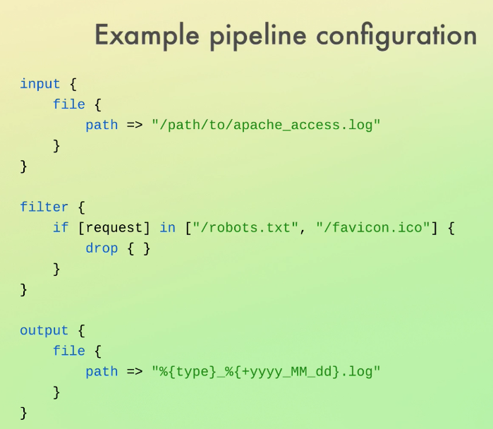
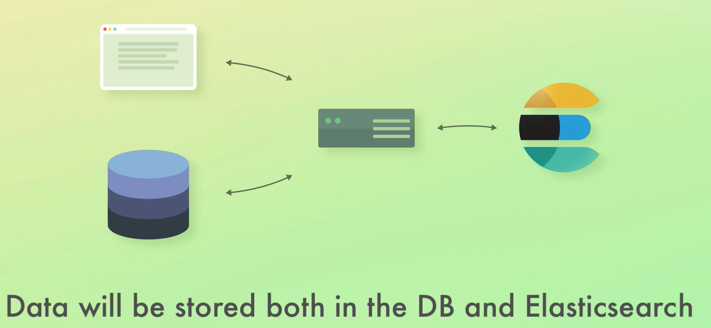

 [Learn Elasticsearch from scratch and begin learning the ELK stack (Elasticsearch, Logstash & Kibana) and Elastic Stack.](https://www.udemy.com/course/elasticsearch-complete-guide/learn/lecture/7373340#overview)

- [What is ElasticSearch?](#what-is-elasticsearch)
  - [Build a powerful search engine](#build-a-powerful-search-engine)
  - [Query & analyze structured data](#query--analyze-structured-data)
    - [Examples](#examples)
      - [Analyze application logs and system metrics](#analyze-application-logs-and-system-metrics)
      - [Send events to Elasticsearch](#send-events-to-elasticsearch)
      - [Excellent at analyzing lots of data](#excellent-at-analyzing-lots-of-data)
      - [Forecast future values with machine learning](#forecast-future-values-with-machine-learning)
- [How does ElasticSearch work?](#how-does-elasticsearch-work)
  - [Data is tore as documents](#data-is-tore-as-documents)
  - [A document's data is separated into fields](#a-documents-data-is-separated-into-fields)
  - [Querying Elasticsearch](#querying-elasticsearch)
  - [Written in Java, build on Apache Lucene](#written-in-java-build-on-apache-lucene)
  - [Easy to use, and highly scalable](#easy-to-use-and-highly-scalable)
  - [🔥 Hottest name in search Engines](#-hottest-name-in-search-engines)
- [Overview of the Elastic Stack](#overview-of-the-elastic-stack)
  - [Kibana](#kibana)
    - [Kibana can manage parts of ElasticsSearch and Logstash](#kibana-can-manage-parts-of-elasticssearch-and-logstash)
    - [Kibana can be used to visualize data](#kibana-can-be-used-to-visualize-data)
  - [Logstash](#logstash)
    - [Data processing pipeline](#data-processing-pipeline)
    - [A Logstash pipeline consists of three parts - or stages - **inputs, filters, and outputs**](#a-logstash-pipeline-consists-of-three-parts---or-stages---inputs-filters-and-outputs)
      - [Inputs](#inputs)
      - [Filters](#filters)
      - [Outputs](#outputs)
    - [Proprietary markup format](#proprietary-markup-format)
  - [X-Pack](#x-pack)
    - [Beats](#beats)
      - [Filebeat](#filebeat)
      - [Beat worth mentioning](#beat-worth-mentioning)
    - [Summary](#summary)
      - [Elasticsearch stack](#elasticsearch-stack)
      - [ELK stack](#elk-stack)
- [Common cenerios](#common-cenerios)
  - [SQL website needs better search function](#sql-website-needs-better-search-function)
    - [If we need data analysis](#if-we-need-data-analysis)
    - [If we are concern about growing pains](#if-we-are-concern-about-growing-pains)
- [Installation](#installation)
  - [Elastic Cloud](#elastic-cloud)
- [Elastisearch directory](#elastisearch-directory)
  - [$ES_HOME](#es_home)
  - [plugins](#plugins)
  - [modules](#modules)
  - [lib](#lib)
  - [config](#config)
- [Undestanding the basic architecture](#undestanding-the-basic-architecture)
  - [**Cluesters** are completely independent of each other by default](#cluesters-are-completely-independent-of-each-other-by-default)
  - [How data is organize and store](#how-data-is-organize-and-store)
    - [Document](#document)
    - [Index](#index)
  - [Summary](#summary-1)
- [Inspecting the cluster](#inspecting-the-cluster)
- [Sharing and scalability](#sharing-and-scalability)
  - [Sharding](#sharding)
  - [Purpose of sharding](#purpose-of-sharding)
  - [Configuring the number of shards](#configuring-the-number-of-shards)
    - [How many shards are optimal?](#how-many-shards-are-optimal)
  - [Summary](#summary-2)
- [Undestanding replication](#undestanding-replication)
  - [How does replication work?](#how-does-replication-work)
  - [Choosing the number of replica shards](#choosing-the-number-of-replica-shards)
  - [Snapshots](#snapshots)
    - [Increasing query throughput with replication](#increasing-query-throughput-with-replication)
  - [Summary](#summary-3)
- [Adding more nodes to the cluster (for development)](#adding-more-nodes-to-the-cluster-for-development)
  - [Approach 1: start a new ElasticSearch instance in the same computer](#approach-1-start-a-new-elasticsearch-instance-in-the-same-computer)
  - [Approach 2: overwriting settings](#approach-2-overwriting-settings)
- [Overview of node roles](#overview-of-node-roles)
  - [Master-eligible](#master-eligible)
  - [Data](#data)
  - [Ingest](#ingest)
  - [Machine learning](#machine-learning)
  - [Coordination](#coordination)
  - [Voting-only](#voting-only)
  - [When to change node roles](#when-to-change-node-roles)
- [Managing Documents](#managing-documents)
  - [Creating and deleting indeces](#creating-and-deleting-indeces)
  - [Indexing documents](#indexing-documents)
  - [Retrieving documents by ID](#retrieving-documents-by-id)
  - [Updating documents](#updating-documents)
    - [Documents are immutable](#documents-are-immutable)
    - [How the update API works](#how-the-update-api-works)
  - [Scripted updates](#scripted-updates)
  - [Upserts](#upserts)
  - [Replacing documents](#replacing-documents)
  - [Deleting documents](#deleting-documents)
  - [Understanding routing](#understanding-routing)
    - [Custom Routing](#custom-routing)
    - [Summary](#summary-4)
  - [How Elasticsearch reads data](#how-elasticsearch-reads-data)
  - [How Elasticsearch writes data](#how-elasticsearch-writes-data)
    - [Primary terms and sequence numbers](#primary-terms-and-sequence-numbers)
      - [Primary terms](#primary-terms)
    - [Sequence numbers](#sequence-numbers)
    - [Recovering when a primary shard fails](#recovering-when-a-primary-shard-fails)
      - [Global and local checkpoints](#global-and-local-checkpoints)
    - [summary](#summary-5)
  - [Understanding document versioning](#understanding-document-versioning)
    - [What's the point of versioning?](#whats-the-point-of-versioning)
    - [What is a version?](#what-is-a-version)
    - [Types of versioning](#types-of-versioning)
  - [Optimistic concurrency control](#optimistic-concurrency-control)
    - [solutions](#solutions)
    - [valid or invalid optimistic concurrency control](#valid-or-invalid-optimistic-concurrency-control)
    - [How do we handle failures?](#how-do-we-handle-failures)
    - [Sumary](#sumary)
  - [update by query](#update-by-query)
    - [Reponse](#reponse)
    - [Not matching all docs have the same the script source fields](#not-matching-all-docs-have-the-same-the-script-source-fields)
    - [How the snapshot is used](#how-the-snapshot-is-used)
    - [conflict proceed](#conflict-proceed)
    - [Summary](#summary-6)
  - [Delete by query](#delete-by-query)
  - [Introduction to the Bulk API](#introduction-to-the-bulk-api)
  - [index vs update](#index-vs-update)
    - [The Bulk API expects data formatted using the NDJSON specification](#the-bulk-api-expects-data-formatted-using-the-ndjson-specification)
    - [Bulk index](#bulk-index)
    - [update and delete](#update-and-delete)
    - [Things to be aware of](#things-to-be-aware-of)
    - [When to use the Bulk API](#when-to-use-the-bulk-api)
    - [Two more things](#two-more-things)
  - [Importing data with cURL](#importing-data-with-curl)

# What is ElasticSearch?

LeasticSearch is a search engine that is used to store and retrieve data. It is a distributed, scalable, and highly available search engine.

## Build a powerful search engine

- Enable search for different types of data
  - like google
  - This includes auto-completion, correcting typos, highlighting matches, handling synonyms, adjusting relevance, etc.
  
  - Can take other factors into account, like location, time, etc.
- search like amazon
  

## Query & analyze structured data


You can write queries that aggregate data and use the results for making pie charts, line charts, or whatever you might need. Elasticsearch is not really a business intelligence solution, but you can indeed get a lot of valuable information out of the data that you store within Elasticsearch.

### Examples

#### Analyze application logs and system metrics

E.g. errors and CPU/memonry usage, etc.

Or also knows as Application Performance Management (APM).

#### Send events to Elasticsearch

E.g. sales, website clicks, phone calls, etc.

#### Excellent at analyzing lots of data

#### Forecast future values with machine learning


This course main focus is search functionality.

# How does ElasticSearch work?

## Data is tore as documents

Similar to rows in relational databases (e.g. MySQL, PostgreSQL, etc.).

## A document's data is separated into fields

Similar to columns in relational databases.


## Querying Elasticsearch

Similar to quering a Rest API.


Also written in Jason.

## Written in Java, build on Apache Lucene

## Easy to use, and highly scalable

Since Elasticsearch is distributed by nature, it scales very well in terms of increasing data volumes and query throughput. So even if you need to search through millions of documents, searches are still going to be lightning fast!

## 🔥 Hottest name in search Engines

# Overview of the Elastic Stack

Technologies developed by Elasticserach BV


## Kibana

An analytics & visualization platform

You can think of Kibana as an Elasticsearch dashboard where you can create visualizations such as pie charts, line charts, and many others.

Kibana is also where you configure change detection and forecasting.

### Kibana can manage parts of ElasticsSearch and Logstash


### Kibana can be used to visualize data


## Logstash


Traditionally, Logstash has been used to process logs from applications and send them to Elasticsearch, hence the name.

Now it has evolved into a general purpose tool.

### Data processing pipeline


The data that Logstash receives, will be handled as events, which can be anything of your choice. They could be:

- log file entries,
- ecommerce orders,
- customers,
- chat messages,
- etc.
These events are then processed by Logstash and shipped off to one or more destinations.

A couple of examples could be:

- Elasticsearch,
- a Kafka queue,
- an e-mail message, or
- to an HTTP endpoint.

### A Logstash pipeline consists of three parts - or stages - **inputs, filters, and outputs**

Each stage can make use of a so-called plugin.


#### Inputs

An input plugin could be a file, for instance, meaning that Logstash will read events from a given file. It could also be that we are sending events to Logstash over HTTP, or we could look up rows from a relational database, or listen to a Kafka queue. There are a lot of input plugins, so chances are that you will find what you need.

#### Filters

while input plugins are how Logstash receives events, filter plugins are all about.

Example:

- Parse to CSV, XML, or JSON, for instance
- We can also do data enrichment, such as looking up an IP address and resolving its geographical location
- Look up data in a relational database

#### Outputs

An output plugin is where we send the processed events to.
**Formally, those places are called stashes**.

So in a nutshell, Logstash receives events from one or more inputs, processes them, and sends them to one or more stashes.

### Proprietary markup format

Markup language similar to Jason and can handle conditional statements



## X-Pack

Adds additional features to the Elasticsearch & Kibana


- 🛡️ Security
  - Adds authentication and authorization for kebana and elasticsearch
  - Integrate with authentication providers
  - Control permissions with fine-grained authorization
- ❤️ Monitoring
  - gain insight into how the Elastic Stack is running
    - E.g
      - CPU & memory usage
      - disk space
      - etc.
  - Get notified if something goes wrong
- 🎤 Alerting
  - Alerting can be used for lots of things
    - E.g
      - if a web server's CPU usage exceeds 90%
      - if application errors reach a threshold
      - Be notified by e-mail, on Slack, or however you prefer
- 🧾 Reporting
  - Export Kibana visualizations and data
  - Reports can be generated on-demand or scheduled
  - Generate reports when certain conditions are fulfilled
  - Customize the look and feel of reports
    - Add your own logo
  - Export data as CSV, e.g. for use within spreadsheets
- 🧠 Machine Learning
  - Enables machine learning for Elasticsearch & Kibana
  - What you can do with machine learning
    - Abnormality Detection
  
    - Forecasting
  
- Graph
  - Analyze the relationships in your data
    - E.g show related products or suggest songs
    - To make this work we need to distinguish between popular and relevant.
      - Suppose that a lot of people listen to Linkin Park and they also enjoy listening to Mozart every now and then. That does not suggest that the two are related, but the strong link between them is just caused by the fact that they are both relatively popular.
      - So essentially what we are looking for, is the uncommonly common, because that says something
  - Graph considers relevance with Elasticsearch
  - Integrate into applications with an API
  - Visualize the relationships within Kibana
  - ❗Graph works out of the box ("plug and play")
- 🏰 Elasticsearch SQL
  - Query Elasticsearch with SQL
  - ElasticSearch queries are written in Query DSL
    - Flexible, but verbose at first
  - Send SQL over HTTP or thorough a JDBC driver

  - The translate API returns the corresponding Elasticsearch query DSL
    - Create to get start with
    - Translate your SQL to query DSL
  - Great getting started tool

### Beats

Collection of data shippers


#### Filebeat


used for collecting log files and sending the log entries off to either Logstash or Elasticsearch.

#### Beat worth mentioning


Filebeat and metricbeat are the most common beats.

### Summary

#### Elasticsearch stack


#### ELK stack


# Common cenerios

## SQL website needs better search function



Best approached. You get your data from the SQL and you duplicate your data into Elasticsearch.

### If we need data analysis

we can use Kabana or build our own custom one.

### If we are concern about growing pains

- we can track it with metricbeat. Send the data to Elasticsearch.
- Set up alerting and monitoring.
- Monitor the access and error logs
  - Response times can be monitored for each endpoint
  - Identify bad deployments
- Setup filebeat to store the logs into Elasticsearch(or logstash) and see the logs in Kibana.
  - Filebeat ships wiht modules for common log file formats
- **Centralize** all event handling with logstash
  - Logstash will process events and send them to Elasticsearch
  - Keeps event handling away of our web application

  -
Ideally, elasticsearch would be readonly

# Installation

[https://www.elastic.co/downloads/elasticsearch](https://www.elastic.co/downloads/elasticsearch)


## Elastic Cloud

[https://www.elastic.co/](https://www.elastic.co/)

[https://www.elastic.co/start](https://www.elastic.co/start)
If you can the defaul config in elasticsearch you have to change kebana config to match.

- Linux

- macOS

- Windows

- docker

# Elastisearch directory

## $ES_HOME

Points to the Elasticsearch home directory

## plugins

Is where our custome code lives or other peoples codes.

## modules

Like plugins but are require and shipped with Elasticsearch.

## lib

Useful scripts

## config

Where you can change the port, where the data is located in this PC and other settings.

# Undestanding the basic architecture

When we start Elasticsearch, we started a node.


**Node** is an instance of Elasticsearch that stores data. Having many nodes that host large amount of data is how large data is stored. No virtual machines or containers require.

For production its recommended to setup nodes to run in separate machines, virtual machine, or within a container.

There are problems with only having a single node in terms of availability and scalability but for development is fine.

Each note bellows to a cluster.

## **Cluesters** are completely independent of each other by default


- Mulitiples are allow,
  - 1 is usually enough
- Can be search
- can serve different purposes
- WHY?
  - To separate thing logically
  - configure things differently

At node starts up, it will either join an existing cluster if configure to do so or it will create its own cluster consisting of just that node.

## How data is organize and store

### Document

Each unit of data that is store within your cluster is called a document. Documents are JSON objects containing whatever data you desire.

When you index a document, the original JSON object that send to Elasticsearch is stored alogn with some metadata that Elasticsearch uses internally.


### Index

Documents are organized within indexes.
An index groups documents together logically, as well as provide configuration options that are related to scalability and availability.

An index is therefore a collection of documents that have similar characteristics and are logically related.


## Summary

Documents are like rows in a sql table.
Index are like tables in a sql database.

- Nodes store the data that we add to Elasticsearch
- A cluster is a collection of nodes
- Data is stored as documents, which are JSON objects
- Documents are grouped together with indices

# Inspecting the cluster

Use kebana dev tools

- inside the dev tool (terminal) the Elasticsearch path is appended by the kebana config
- leading forward slash is not require like in Nesetjs


api are like echelon-api modules
commands are like echelon-api endpoint

```
GET _cluster/health

GET _cat/nodes?v

GET _nodes/

GET _cat/indices?v

```

# Sharing and scalability

## Sharding

A way to divide the indices into smaller pieces.

- Each piece is referred to as a shard
- Sharding is done at the index level
- The main purpose is to horizontally scale the data volume


- A shard is an independent index ... kind of
- Each shard is an Apache Lucene index
- An Elasticsearch index consists of one or more Lucene indexes
- A shard has no predefined size; it grows as documents are added
- A shard may store up to about two billion documents

## Purpose of sharding

- Mainly to be able to store more documents
  - Can store billions of documents in a index with sharding and without it you cannot
- To easier fit large indices onto nodes
- Improved performance
  - Parallelization of queries increases the throughput of an index
    - Search query can be run in multiple shards at the same time
      - Increase performance

`GET _cat/indices?v` see all available indices

## Configuring the number of shards

Default is 1

- An index contains a single shard by default
- Indices in Elasticsearch < 7.0.0 were created with five shards
  - This often led to over-sharding
- Increase the number of shards with the Split API
- Reduce the number of shards with the Shrink API

### How many shards are optimal?

- There is no formula that will yield a number for us :slightly_frowning_face:
- There are many factors involved, so it depends
- Factors include
  - the # of nodes and
  - their capcity,
  - the # of indices
  - their sizes
  - the # of queries
  - etc
- Anticipate millions of documents? Consider adding a couple of shards
  - 5 shards is a good starting point
- ❗ Need to store some thousands of documents? Stick to the default settings
  - until needed

## Summary

- sharding splits indices into smaller pieces
- Sharding increases the numbe of documents an index can store
- Sharding makes it easier to fit large indices onto nodes
- Sharding may improve query throughput
- An index defaults to having one shard
- Add a couple of shards for large indices; otherwise use default settings

# Undestanding replication

- What happens if anode's hard drive fails? 🔥
  - We loose data :slightly_frowning_face:  
- Hardware canf ial at any time, so we need to handle that somehow
- Elasticsearch supports replication for fault tolerance
- Replication is supported natively and enabled by default 🥳
- With many databses, setting up replication can be a pain 🤔
- Replication is extremely easy with Elasticsearch ❤️

## How does replication work?

- Replication is configured at the index level
- Replication works by creating copies of shards, referred to as replica shards
- A shard that has been replicated, is called a primary shard
- A primary shard and its replica shards are preferred to as a replication group
- Replica shards are a complete copy of a shard
- A replica shard can serve search requests, exactly like its primary shard
- The number of replicas can be configured at index creation


**Replicas are never store with primary shard**


If one disappear the copy is store in another node(copy).

**Two or more nodes are needed for replication.**

## Choosing the number of replica shards

- How many replica shards are ideal, depends on the use case
- E.g. is the data stored elsewhere, such as in a RDBMS?
- Is it OK for data to be unavailable while you restore it?
- For mission critical systems, downtime is not acceptable
- Replicate  shards once if data loss is not a disaster
- For critical systems, data should be replicated at least twice.

## Snapshots

- Elasticsearch supports taking snapshots as backups
- snapshots can be used to restore to a given point in time
- Snapshots can be taken at the index level, or for the entire cluster
- **Use snapshots for backups, and replication for high availability ( and performance)**
  - snapshots are like to go back to a previous state of your data like github
  - replicas are for latest data being available
    - and multi search
    - recovers from node failure and act like nothing happen


### Increasing query throughput with replication

- Replica shards of a replication group can serve different search requests simultaneously
  - This increases the number of requests that can be handled at the same time
- Elasticsearch intelligently routes requests to the best shard (more on that later)
- CPU parallelization improves performance if multiple replica shards are stored on the same node

## Summary

- Replication is used to ensure high availability for indices
- A side benefit is increased query throughput
- Replication works by copying a given shard's data
- A replica shard is **never** stored on the same node as its primary shard
- Replicate shards once if your system isn't critical; replicate at least twice if your system is mission critical
- Snapshots can be taken as backups of specific indices, or the whole cluster
  
# Adding more nodes to the cluster (for development)

- to scale Elasticsearch, we need to add addtional nodes eventually
- When doing so, replica shards are also assigned
- This approach cannot be used with Elastic Cloud
- We will be adding two nodes to our cluster, in two different ways
- The approaches are intended for development and not for production

Because we are running additional nodes in the same machine only the node name needs to be changed. If we weren't then we would need additional configuration.

## Approach 1: start a new ElasticSearch instance in the same computer

/new-node-name-change.png)

Not working for 8.x +

## Approach 2: overwriting settings

1. Reuse an existing Elsticsearch directory
2. Start up Elasticsearch, overwrite the following settings at the command line
   1. cluster.name
   2. node.name
   3. path.data
   4. path.logs

Quick but not best practice, and not best practice.

`elasticsearch/bin/elasticsearch -Enode.name=node-3/data -Epath.data=./node-3/data -Epath.logs=./node-3/logs`

/node-added.png)

# Overview of node roles

## Master-eligible

- The node may be elected as the cluster's master node
- A master node is responsible for creating and deleting indices, among others
- A node with this role will not automatically become the master node
  - (unless there are no other master-eligible nodes)
  - if no dedicated master nodes, then master nodes are assigned by nodes vote.
- May be used for having dedicated master nodes
  - Useful for large clusters

`Configuration: node.master: true | false`

## Data

- Enables a node to store data
- Storing data includes performing queries related to that data, such as search queries
- For relatively small clusters, this role is almost always enabled
- Useful for having dedicated master nodes
- Used as part of configuring a dedicated master node

`Configuration: node.data: true | false`

## Ingest

- Enables a node to run ingest pipelines
- Ingest pipelines are a series of steps (processors) that are performed when indexing documents
  - Processors may manipulate documents, e.g. resolving an IP to lat/lon
- A simplified version of Lagstash, directly within Elasticsearch
- This role is mainly useful for having dedicated ingest nodes

`Configuration: node.ingest: true | false`

## Machine learning

- `node.m1` identifies a node as a machine learning node
- `xpak.ml.enabled` enables or disables the machine learning API for the node
- Useful for running ML jobs that don't affect other tasks

```
Configuration: 
node.ml: true | false
xpack.ml.enabled: true | false
```

## Coordination

- Coordination refers to the distribution of queries and the aggregation of results
- Useful for coordination-only nodes (for large clusters)
- Configured by disabling all other roles

```
Configuration:
node.master: false
node.data: false
node.ingest: false
node.ml: false
xpack.ml.enabled: false
```

Essentially can be use as a low balancer

## Voting-only

- Rarely used, and you almost certainly won't use it either
- A node with this role, will participate in the voting for a new master node
- The node cannot be elected as the master node itself, though
- Only used for large clusters

`Configuration: node.voting_only: true | false`

## When to change node roles

- "It depends"
- Usefuul for large clusters
- Typically done when optimizing the cluster to scale the number of requests
- You will ofter times change other things first
  - E.g. the number of nodes, shards, replica shards, etc/
- Better understand what hardware resources are used for
- Only change roles if you know what you are doing

# Managing Documents

- How Elasticsearch reads and writes data
- Document Versioning
- Optimistic concurrency control
- Importing data with the Bulk API and cURL

## Creating and deleting indeces

Elasticsearch URL is appending to path. In development is `localhost:9200/`.

```
# delete index
DELETE pages

# creating index
PUT products
{
  "settings": {
    "number_of_shards": 2,
    "number_of_replicas": 2
  }
}

# getting index
GET products
```

## Indexing documents

`action.auto_create_index` If enabled, indices will automatically be created when adding documents.

```
# new indexing a document with auto index generation
POST products/_doc
{
  "name": "Coffee Maker",
  "price": 64,
  "in_stock": 10
}

# indexing new document with our define ID
PUT products/_doc/100
{
  "name": "Toaster",
  "price": 49,
  "in_stock": 4
}
```

## Retrieving documents by ID

`# Get products
GET products/_doc/sy6_lH8B0sPd9sLWrQsX`

## Updating documents

```
# Get products
GET products/_doc/sy6_lH8B0sPd9sLWrQsX

# update a document field like a patch or adds a new field
POST products/_update/sy6_lH8B0sPd9sLWrQsX
{
  "doc": {
    "in_stock": 3
  }
}

# Add new field to an existing document
POST products/_update/sy6_lH8B0sPd9sLWrQsX
{
  "doc": {
    "tags": ["electronics"]
  }
}
```

A put would replace all field with given input.
**If there is no change the result will be noop for no update**

### Documents are immutable

- Elasticsearch documens are immutable (!)
- We actually replaaced documents in this lecture
- The update API did some things for us, making it look like we updated documents

### How the update API works

- The current document is retrieved
- The field values are changed
- The existing document is replaced with the modified document
- We could do the exact same thing at the application level

## Scripted updates

Custom code that run like a programming language

```
# script update the stock field by removing one every time is ran
POST products/_update/sy6_lH8B0sPd9sLWrQsX
{
  "script": {
    "source": "ctx._source.in_stock--"
  }
}
# script update the stock field to 10
POST products/_update/sy6_lH8B0sPd9sLWrQsX
{
  "script": {
    "source": "ctx._source.in_stock =10"
  }
}

# use params in the script
POST products/_update/sy6_lH8B0sPd9sLWrQsX
{
  "script": {
    "source": "ctx._source.in_stock -= params.quantity ",
    "params": {
      "quantity": 4
    }
  }
}

# Get products a product by id
GET products/_doc/sy6_lH8B0sPd9sLWrQsX
```

The result will always be update even if the value didn't change except if you set it up in your logic.


## Upserts

Conditionally update a document if it exists, otherwise create it

```
# create or update doc
# upsert creates the doc if doc not found
POST products/_update/101
{
  "script": {
    "source": "ctx._source.in_stock++"
  },
  "upsert": {
    "name": "Blender",
    "price": 399,
    "in_stock": 5
  }
}

# Get created product document by id
GET products/_doc/101
```

## Replacing documents

Running a PUT will replace the document with the given input.

```
PUT products/_doc/100
{
  "name": "Toaster",
  "price": 79,
  "in_stock": 4
}

GET products/_doc/100
```

## Deleting documents

`DELETE products/_doc/100`

## Understanding routing

How does Elasticsearch know where to store documents? How are documents found once they have been indexed?
  **The answer is routing**

Routing is the process of resolving a shard for a document

Elasticsearch formula for routing:
`shard_num = hash(_routing) % num_primary_shards`


### Custom Routing

- Routing is 100% transparent when using Elasticsearch
- This makes Elasticsearch easier to use and learn
- It is possible to customize routing, though, for various purposes
  - That's quite complicatd, so let's save that for later
- The defaul routing strategy ensures that documents are distributed evenly

### Summary

- Routing is the process of resolving a shard for a document
- A formula is used when indexing, retrieving, and updating documents
- Routing may be customized (advanced)
- The default routing strategy ensures that documents are distributed evenly
- One of the reasons why an index' shards cannot be changed, is that the routing formula would then yield different results

## How Elasticsearch reads data


- A request received and handled by a coordinating node
- Routing is used to resolve the document's replication group
- ARS is used to send the query to the best available shard
  - ARS is short for Adaptive Replica Selection
  - ARS helps reduce query reponse times
  - ARS is essentially an intelligent load balancer
- The coordinating node conects the reponse and sends it to the client

## How Elasticsearch writes data

### Primary terms and sequence numbers

#### Primary terms

A way to distinguish between old and new primary shards

- Essentially a counter for how many times the primary shard has been changed
- The primary term is appended to write operations


### Sequence numbers

Essentially a counter that is incremented for each write operation


- Appended to the write operations together with the primary term.
- The primary shard increases the sequence number
- Enables Elasticsearch to order write operations

### Recovering when a primary shard fails


- Primary terms and sequence numbers are key when Elasticsearch needs to recover from a primary shard failure
  - Enables Elasticsearch to more efficiently figure out which write operations need to be applied
- For large indices, this process is really expensive
  - To speed things up, Elasticsearch uses checkpoints

#### Global and local checkpoints

- Essentially sequence numbers
- Each replication group has a global checkpoint
- Each replica shard has a local checkpoint
- Global checkpoints
  - The sequence number that all active shards within a replication group have been aligned at least up to
- Local checkpoints
  - The sequence number for the last write operation that hwa performed

### summary

- write operations are sent to primary shards
- The primary shard forwards the operation to its replica shards
- Primary terms and sequence numbers are used to recover from failures
- Global and local checkpoints help speed up the recovery process
- Primary terms and sequence numbers are available within responses

## Understanding document versioning

### What's the point of versioning?

You can tell how many times a document has been modified. Probably not that useful.

- Versioning is hardly used anymore, and is mostly a thing form the past
- It was previously the way to do optimistic concurrency control
  - Now there is a better way, though
  
**You might see this field being used for clusters running old versions**

### What is a version?

- Not a revision history of documents
- Elasticsearch stores an _version metadata field with every document
  - The value is an integer
  - It is incremented by one when modifying a document
  - The value is retained for 60 seconds when deleting a document
    - Configured with the index.gc_deletes setting
  - The _version field is returned when retrieving documents
    - 

### Types of versioning

The default versioning type is called internal versioning

There is also an external versioning type

- Useful when versions are maintained outside of Elasticsearch
- E.g. when documents are also stored in a RDBMS.


## Optimistic concurrency control

Prevent overwriting documents inadvertently due to concurrent operations. Example of a problem:

- Handling concurrent visitors for a web application


### solutions


### valid or invalid optimistic concurrency control

```
# optimistic oncurrency control
POST products/_update/100?if_primary_term=1&if_seq_no=7
{
  "doc": {
    "in_stock": 123
  }
}
```


### How do we handle failures?

Handle at the situation at the application level

- Retrieve the document again
- use _primary_term and_seq_no for a new update request
- Remember to perform any calculations that use field values again

### Sumary

- sending write requests to Elasticsearch concurrently may overwrite changes made by other concurrent processes
- Traiditonally, the _version field was used to prevent this
- Today, we use the _primary_term and_seq_no fields to prevent this
- Elasticsearch will reject a write operation if it contains the wrong primary term or sequence number
  - This should be handled at the appliation level

## update by query

Update all matching documents sequentially

```
# update by query
# updates docs that match the query
# if the matching doc doesn't have the field from the script source it returns an error
POST products/_update_by_query
{
  "script": {
    "source": "ctx._source.in_stock--"
  }, 
  "query": {
    "match_all": {}
  }
}
```

### Reponse

```
{
  "took" : 222,
  "timed_out" : false,
  "total" : 4,
  "updated" : 4,
  "deleted" : 0,
  "batches" : 1,
  "version_conflicts" : 0,
  "noops" : 0,
  "retries" : {
    "bulk" : 0,
    "search" : 0
  },
  "throttled_millis" : 0,
  "requests_per_second" : -1.0,
  "throttled_until_millis" : 0,
  "failures" : [ ]
}
```

### Not matching all docs have the same the script source fields

```
{
  "error": {
    "root_cause": [
      {
        "type": "script_exception",
        "reason": "runtime error",
        "script_stack": [
          "ctx._source.in_stock--",
          "^---- HERE"
        ],
        "script": "ctx._source.in_stock--",
        "lang": "painless"
      }
    ],
    "type": "script_exception",
    "reason": "runtime error",
    "script_stack": [
      "ctx._source.in_stock--",
      "^---- HERE"
    ],
    "script": "ctx._source.in_stock--",
    "lang": "painless",
    "caused_by": {
      "type": "null_pointer_exception",
      "reason": null
    }
  },
  "status": 400
}
```


### How the snapshot is used

If a document has been modified since taking the snapshot, the query is aborted

- prevents overwriting changes made after the snapshot was taken
  - The query may take a while to finish if updating many documents
- Each document's primary term and sequence number is used use
  - A document is only updated if the value smatch the ones from the snapshot
  - As you know, this is called optimistic oncurrency control
- the # of version conflicts is returned within the version_conflicts key

### conflict proceed

To count version conflicts instead of aborting the query, the conflicts option cab be set to proceed

```
POST products/_update_by_query
{
  "conflict": "proceed",
  "script": {
    "source": "ctx._source.in_stock--"
  }, 
  "query": {
    "match_all": {}
  }
}
```

### Summary

- The query creates a snapshot to do optimistic concurrency control
- Search queries and bulk request are sent to replication groups sequentially
  - **Elasticsearch retries these queries up to ten times**
  - **If the queries still fail, the whole query is aborted**
    - **Any changes already made to documents, are not rolled back**
- The Api returns information about failures
- If a document has been modified since taking the snapshot, the query is aborted
  - This is checked with the document's primary term, and sequence number
- To count version conflicts instead of aborting the query, the conflicts option cab be set to proceed

## Delete by query

Delete multiple documents within a single query. Similary to the Update by Query API.

```
# delete multiple documents
POST products/_delete_by_query
{
  "query": {
    "match_all": {}
  }
}
```

```
{
  "took" : 48,
  "timed_out" : false,
  "total" : 4,
  "deleted" : 4,
  "batches" : 1,
  "version_conflicts" : 0,
  "noops" : 0,
  "retries" : {
    "bulk" : 0,
    "search" : 0
  },
  "throttled_millis" : 0,
  "requests_per_second" : -1.0,
  "throttled_until_millis" : 0,
  "failures" : [ ]
}
```

## Introduction to the Bulk API

Perform **index, create, update, and delete** on many documents with a single query with the BULK API

the first line defines the action and some metadata, while the second line defines the source document.

## index vs update
The "create" action will fail if the document already exists, which is not the case for the "index" action. If you use the "index" action, the document will be added if it doesn't already exist; otherwise it will be replaced.

### The Bulk API expects data formatted using the NDJSON specification

action_and_metadata\n
optional_source\n
action_and_metadata\n
option_source\n

### Bulk index

```
# index: creating an index and adding the first doc
# create: adding to an index
POST _bulk
{"index": {"_index": "products", "_id": 200}}
{ "name": "Espresso Machine", "price": 199, "in_stock": 5 }
{ "create": { "_index": "products", "_id": 201 }}
{ "name": "Milk Frother", "price":149, "in_stoack": 14}
```

```
{
  "took" : 180,
  "errors" : false,
  "items" : [
    {
      "index" : {
        "_index" : "products",
        "_id" : "200",
        "_version" : 1,
        "result" : "created",
        "_shards" : {
          "total" : 3,
          "successful" : 1,
          "failed" : 0
        },
        "_seq_no" : 24,
        "_primary_term" : 2,
        "status" : 201
      }
    },
    {
      "create" : {
        "_index" : "products",
        "_id" : "201",
        "_version" : 1,
        "result" : "created",
        "_shards" : {
          "total" : 3,
          "successful" : 1,
          "failed" : 0
        },
        "_seq_no" : 25,
        "_primary_term" : 2,
        "status" : 201
      }
    }
  ]
}
```

**See new addtion**

```
GET products/_search
{
  "query": {
    "match_all": {}
  }
}
```

### update and delete

```
# adding the doc before bulk let you exclude index field
# bulk update has similiar syntax of updating a document at a time
# the delete action is the only one that doesn't expect a second line
POST products/_bulk
{ "update": { "_id": 201} }
{ "doc": {"price": 129 }}
{ "delete": { "_id":200 } }
```

```
{
  "took" : 57,
  "errors" : false,
  "items" : [
    {
      "update" : {
        "_index" : "products",
        "_id" : "201",
        "_version" : 2,
        "result" : "noop",
        "_shards" : {
          "total" : 3,
          "successful" : 1,
          "failed" : 0
        },
        "_seq_no" : 26,
        "_primary_term" : 2,
        "status" : 200
      }
    },
    {
      "delete" : {
        "_index" : "products",
        "_id" : "200",
        "_version" : 2,
        "result" : "deleted",
        "_shards" : {
          "total" : 3,
          "successful" : 1,
          "failed" : 0
        },
        "_seq_no" : 29,
        "_primary_term" : 2,
        "status" : 200
      }
    }
  ]
}
```

### Things to be aware of

- The HTTP content-Type header should be set as followe
  - Content-Type: application/x-ndjson
  - application/json is accepted, but that's not the correct way
- The Console tool handles this for us
  - The Elasticsearch SDKs also handle this for us use
  - Using HTTP clients  we need to handle this ourselves

- Each line **must** end with a newline character
  - This **includes** the last line
    - In a text editor, this means that the last line should be empty
  - Automatically handled with Console tool
  - Typically a script will generate the bulk file, in which case you need to handle this
  - Don't type out \n or \r\n in a text editor

- A fialed action will **not** affect other actions
- Neither will the bulk request as a whole be aborted
- The Bulk API returns detailed information about each action
  - Inspect the items key to see if a given action succeeded
    - The order is the same as the actions within the request
  - The errors key conveniently tells us if any errors occurerred

### When to use the Bulk API

- When you need to perform lots of write operations at the same time
  - When importing data or modifying lots of data
- The Bulk API is more efficient than sending individual write requests
  - Avoids a lot of network round trips

### Two more things

- Routing is used to resolve a document's shard
  - The routing can be customized if neceessary
- The Bulk API supports optimistic concurrency control
  - Include the if_primary_term and if_seq_no parameters within the action metadata

## Importing data with cURL

cURL is the most popular command line tool for sending HTTP requests. Already installed in macOS.
